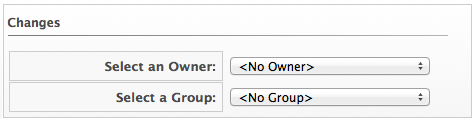

# Setting Ownership of a Virtual Machine or Template

Set the owner of a virtual machine or template by either individual
user or group. This allows you an additional way to filter
configuration items.

1. Browse to menu: **Compute > Infrastructure > Virtual Machines**.

2. Click the accordion for the items to analyze.

3. Click the item to set ownership.

4. Click **Configuration**, and then
    **Set Ownership** on the taskbar.

5. From the **Select an Owner** dropdown, select a user.

    

6. From the **Select a Group** dropdown, select a group.

7. Click **Save**.
