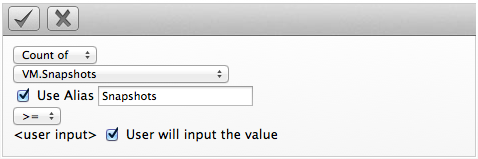
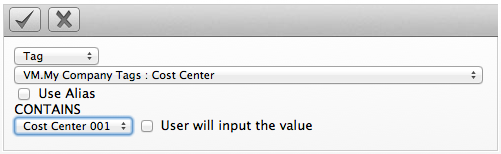
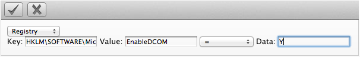
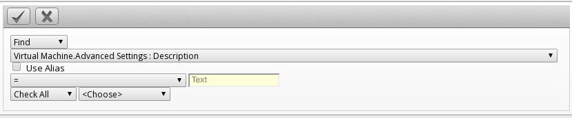

# Creating a Virtual Machine or Template Filter

1.  Browse to menu: **Compute > Infrastructure > Virtual Machines**.

2.  Go to the **VMs** or **Templates** accordion.

3.  Click **All VMs** or **All Templates**, then click
     (**Advanced Search**) to open the
    expression editor.

4.  Use the expression editor to choose the appropriate options for your
    criteria. Based on what you choose, different options will show.

      - For all of the types of searches, you have the options of
        creating an alias and requested user input. Select **Use Alias**
        to create a user friendly name for the search. If you are
        requested user input for the search, this text will show in the
        dialog box where the input is requested.

      - Click **Field** to create criteria based on field values.

        

      - Click **Count of** to create criteria based on the count of
        something, such as the number of snapshots for a virtual
        machine, or the number of virtual machines on a host.

        

      - Click **Tag** to create criteria based on tags assigned to your
        virtual infrastructure, such as for power states or production
        tagging.

        

      - Click **Registry** to create criteria based on registry values,
        such as the DCOM status of a Windows system. Note this criteria
        applies only to Windows operating systems.

        

      - Click **Find** to seek a particular value, and then check a
        property.

        

5.  Click  (**Commit Expression Element
    Changes**) to add the expression.

6.  Click **Save**.

7.  Type in a name for the search expression in **Save this VM** search
    as. (Note that this title depends on the type of resource you are
    searching.) To set the filter to show globally, check **Global
    search**.

8.  Click **Save**.

The filter is saved and will show in the **My Filters** area of the
**Filter** accordion. If you checked **Global search**, the filter will
show under **Global Filters**.
