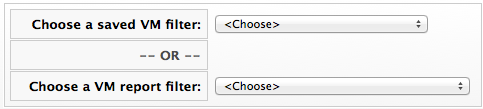
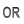

# Loading a Report Filter or Search Expression

1.  Navigate to menu:Compute\[Infrastructure \> Virtual Machines\].

2.  Click the accordion for the items to search either **VMs** or
    **Templates**.

3.  Click  (**Advanced Search**) to open the
    expression editor.

4.  Click **Load**.

5.  Select either a saved virtual machine search or a virtual machine
    report filter.

    **Note:**

    The set of items to select will depend on the type of resource you
    are searching.

    

    

6.  Click **Load** to load the search expression.

7.  If you want to edit the expression, click on it and make any edits
    for the current expression.

      - Click  (**Commit expression element
        changes**) to add the changes.

      - Click  (**Undo the previous change**)
        to remove the change you just made.

      - Click  (**Redo the previous change**)
        to put the change that you just made back.

      - Click  (**AND with a new expression
        element**) to create a logical AND with a new expression
        element.

      - Click  (**OR with a new expression
        element**) to create a logical OR with a new expression element.

      - Click  (**Wrap this expression element
        with a NOT**) to create a logical NOT on an expression element
        or to exclude all the items that match the expression.

      - Click  (**Remove this expression
        element**) to take out the current expression element.

8.  Click **Load**.

9.  Click **Apply**.
