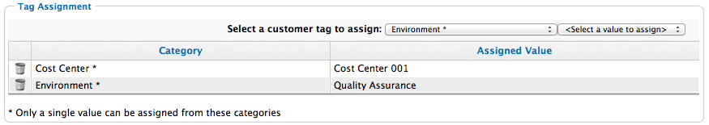

# Tagging Virtual Machines and Templates

1. Browse to menu: **Compute > Infrastructure > Virtual Machines**.

2. Click the accordion for the items to tag.

3. Check the items to tag.

4. Click  **Policy**, and then  **Edit Tags**.

5. Select a customer tag from the first dropdown, and then a value for
    the tag.

    
