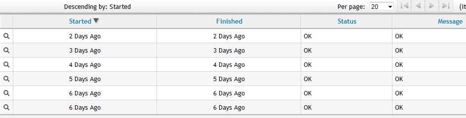

# Viewing Analysis History for a Virtual Machine or Template

Each time a SmartState Analysis is performed on a virtual machine, a
record is created of the task. This information is accessed either from
the virtual machine accordion or the virtual machine summary. Use this
detail to find when the last analysis was completed and if it completed
successfully. If the analysis resulted in an error, the error is shown
here.

1.  Navigate to menu:Compute\[Infrastructure \> Virtual Machines\].

2.  Click the accordion for the item to view genealogy.

3.  Click on the item to view its **Summary**.

4.  From the **Relationships** area in the **Summary**, click **Analysis
    History**. A history of up to the last 10 analyses is displayed.

    

5.  Click on a specific analysis to see its details.
