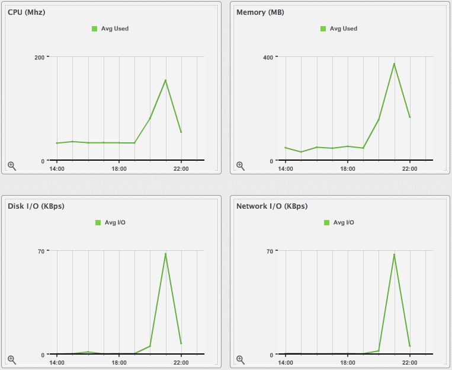
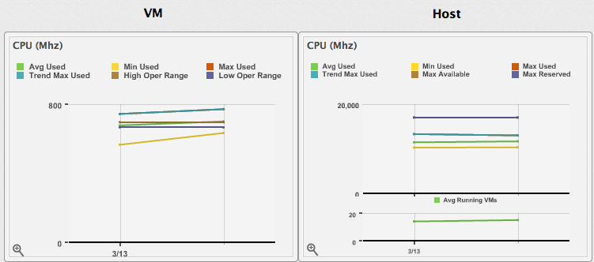

# Viewing Capacity and Utilization Charts for a Virtual Machine

You can view capacity and utilization data for virtual machines that are
part of a cluster. Note that daily charts only include full days of
data. If all 24 data points for a day are not available, daily charts
are not displayed. For some capacity and utilization data,
{{ site.data.product.title_short }} calculates and shows trend lines in the charts which are
created using linear regression. The calculation uses the capacity and
utilization data collected by {{ site.data.product.title_short }} during the interval you
specify.

**Note:**

You must have a server with network visibility to your provider assigned the server role of **Capacity & Utilization Collector** to use this feature.

The virtual machine must be powered on to collect the data.

1.  From menu:Compute\[Infrastructure \> Virtual Machines\], click the
    accordion that you want to view capacity data for.

2.  Click the item you want to view.

3.  Click  (**Monitoring**), and then
     (**Utilization**).

4.  From **Interval**, select to view **Daily**, **Hourly**, or **Most
    Recent Hour** data points. When choosing **Daily**, you can also
    select the **Date**, and how far back you want to go from that date.
    When selecting **Hourly**, you can select the date for which you
    want to view hourly data. If you are using **Time Profiles**, you
    will be able to select that as an option, also.

    

5.  From **Compare to**, select **Parent Host** or **Parent Cluster**.
    The capacity and utilization charts for both items will show
    simultaneously.

    

**Note:**

Daily charts only include full days of data. This means {{ site.data.product.title_short }} does not show daily data for a day without a complete 24 data point range for a day.

For information about data optimization including utilization trend reports, see [Data Optimization](../managing_infrastructure_and_inventory/index.html#data-optimization).
