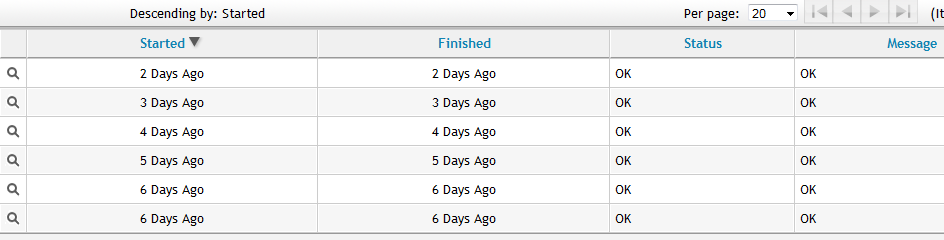

# Viewing Analysis History for an Instance or Image

Each time a SmartState Analysis is performed on an instance, a record is
created of the task. This information is accessed either from the
instance accordion or the instance summary. Use this detail to find when
the last analysis was completed and if it completed successfully. If the
analysis resulted in an error, the error is shown here.

1.  Navigate to menu:Compute\[Clouds \> Instances\].

2.  Click the accordion for the desired item to view analysis history.

3.  Click on the item to view its summary.

4.  From the **Relationships** area in the summary, click **Analysis
    History**. A history of up to the last 10 analyses is displayed.

    

5.  Click on a specific analysis to see its details.
