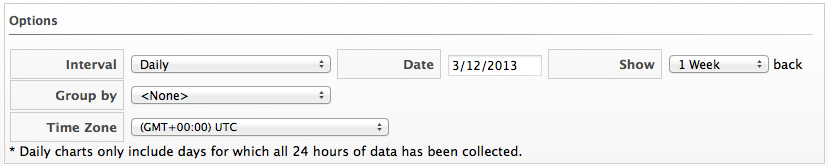
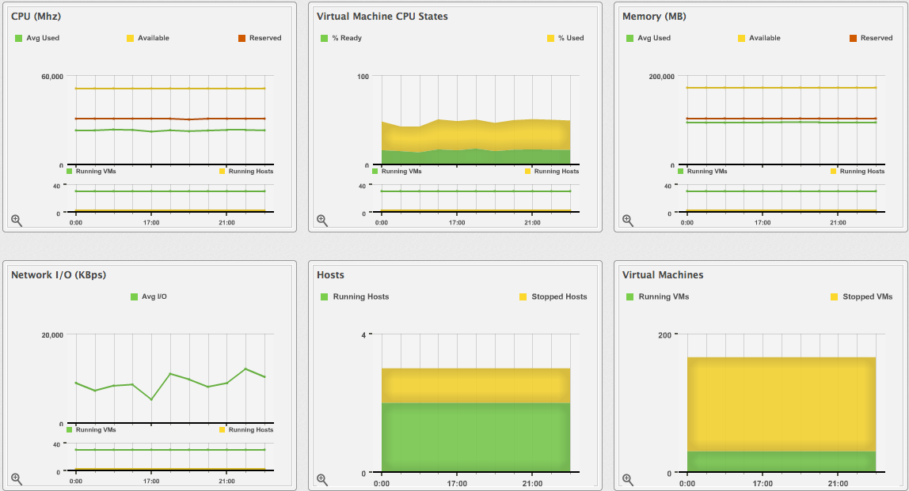

# Viewing Capacity and Utilization Charts for a Cluster

View capacity and utilization for a cluster.

1.  Browse to menu: **Compute > Infrastructure > Clusters**.

2.  Click the cluster to view Capacity and Utilization data.

3.  Click  (**Monitoring**), and then
     (**Utilization**) or from the accordion
    menu, click menu:Properties\[Capacity & Utilization\].

    

4.  From **Interval**, select to view hourly or daily data points and
    the dates to view data. Use **Group by** to group the lines by
    SmartTags. Use **Time Profiles** to select a time range for the
    data.

The **Capacity & Utilization** charts display

**Note:**

Daily charts only include full days of data. If a day does not include all the 24 data points for a day, the data does not show for that day.

For information about data optimization including utilization trend reports, see [Data Optimization](../managing_infrastructure_and_inventory/index.html#data-optimization).
