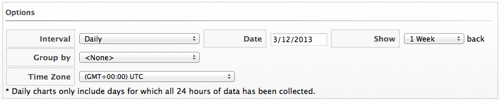
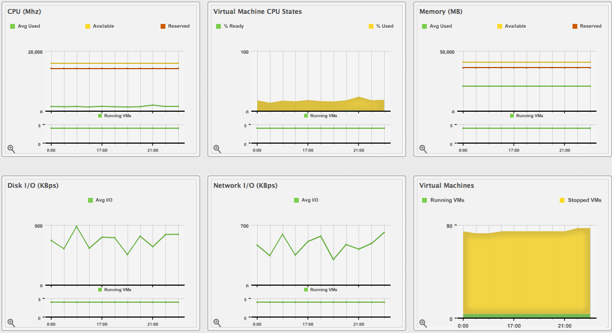

# Viewing Capacity and Utilization Charts for a Host

View Capacity & Utilization data for hosts that are part of a cluster.

Your {{ site.data.product.title }} server requires network visibility to the provider
assigned the **Server Role** of **Capacity & Utilization Collector** to
enable this feature.

1.  Navigate to menu:Compute\[Infrastructure \> Hosts\].

2.  Click the Host to view capacity data.

3.  Click  (**Monitoring**), and then
     (**Utilization**) or from the Host
    accordion, click menu:Properties\[Capacity & Utilization\].

4.  From **Interval**, select to view hourly or daily data points and
    the dates to view data. Use **Group by** to group the lines by
    SmartTags. Use **Time Profiles** to select a time range for the
    data.

    

The charts are displayed for CPU, memory, disk, network, and running
virtual machines.

Daily charts only include full days of data. If a day does not include
all the 24 data points for a day, the data does not show for that day.

For information about data optimization including utilization trend
reports, see [???](#data-optimization).
