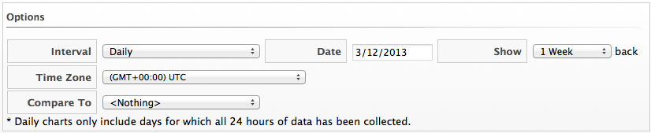
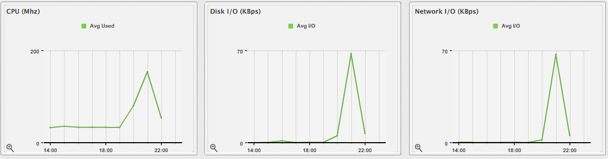

# Viewing Capacity and Utilization Charts for an Instance

View capacity and utilization data for instances that are part of a
cluster.

**Note:**

You must have a server with network visibility to your provider assigned
the server role of **Capacity & Utilization Collector** to use this
feature.

1.  Navigate to menu:Compute\[Clouds \> Instances\].

2.  Click the accordion to view capacity data.

3.  Click the item to view.

4.  Click  (**Monitoring**), and then  (**Utilization**) on the taskbar.

5.  Select to view hourly, most recent hour, or daily data points for the dates to view data.

    

6.  Select a **Time Profile**.

**Note:**

Daily charts only include full days of data. This means {{ site.data.product.title_short }} does not show daily data for a day without a complete 24 data point range for a day.

For information about data optimization including utilization trend reports, see [Data Optimization](../managing_infrastructure_and_inventory/index.html#data-optimization).
