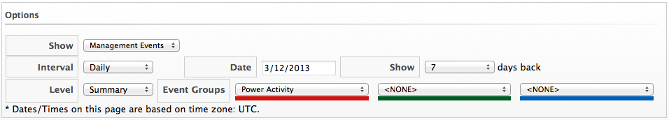

# Viewing Cluster Timeline

Use the cluster timeline to see a graphical depiction of operational and configuration
events over time.

1. Browse to menu: **Compute > Infrastructure > Clusters**.

2. Click the cluster to view the timeline.

3. Click  **Monitoring**, and then
    **Timelines** or from the accordion menu, click menu:
   **Properties > Timelines**.

4. From **Options**, customize the period of time to display, and the types of events to see.

    

    - Use the **Interval** dropdown to select hourly or daily data points.

    - Use **Date** to type the date for the timeline to display.

    - If you select to view a daily timeline, use **Show** to set how many days back to go. The maximum history is 31 days.

    - The three **Event Group** dropdowns allow the selection of different groups of events to display. Each has its own color.

    - From the **Level** dropdown, select a **Summary** event if needed, or a **Detail** list of events. For example, the detail level of a *Power On* event might include the power on request, the starting event, and the actual **Power On** event. If you select **Summary**, the timeline only displays the Power On event.

5. To see more detail on an item in the timeline, click on it. A balloon appears with a
   clickable link to the resource.
