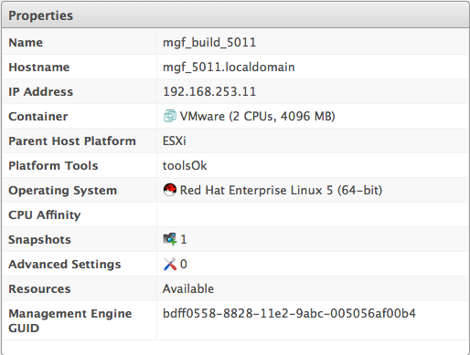
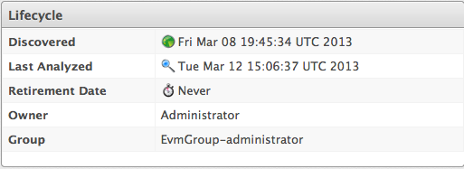
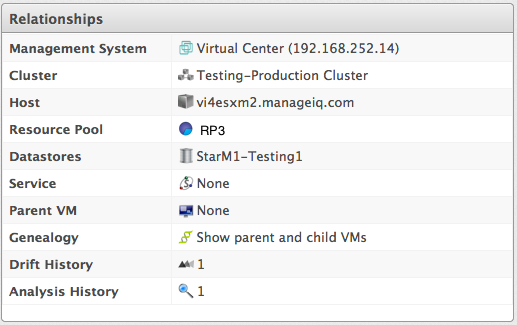
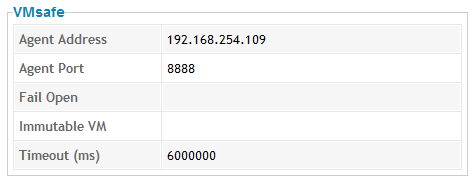
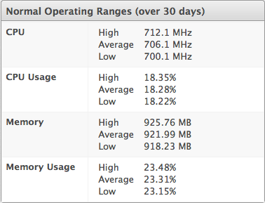
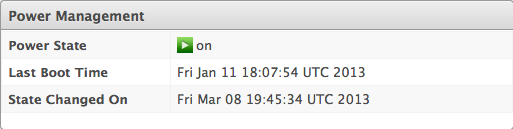
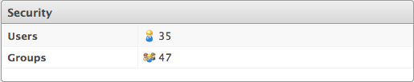
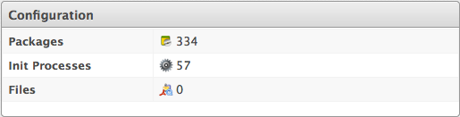
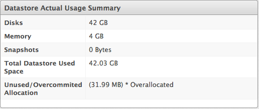

# Virtual Machine or Template Summary

When you click on a specific virtual machine or template, you will see
the **Virtual Thumbnail**, and an operating system-specific screen of
the item, called the **Summary**. Where applicable, click on a
subcategory of the **Summary** to see more detail on that section.

**Note:**

When you perform a SmartState Analysis on a virtual machine or template,
you get more detailed information in these categories.

  - **Properties** include information such as the base operating
    system, hostname, IP addresses, Virtual Machine vendor, CPU
    Affinity, devices attached to the system, and snapshots. This
    includes the ability to analyze multiple partitions, multiple disks,
    Linux logical volumes, extended partitions, and Windows drives. Some
    categories can be clicked on for additional detail. For example,
    click **Container** to view notes associated with a virtual machine.

    

  - **Lifecycle** shows the date of discovery and the last analysis. If
    a retirement date and time or owner has been set, these display as
    well.

    

  - **Relationships** include information on the parent host, genealogy
    such as parent and child virtual machines, and drift.

    

  - **Storage Relationships** shows relationships to Filers, LUNs,
    Volumes and File Shares.

  - **VMsafe** shows properties of the VMsafe agent if it is enabled.

    

  - **Normal Operating Ranges** shows the values for the normal
    operating range for this virtual machine. These statistics are used
    in calculating right sizing recommendations.

    

  - **Power Management** displays the current power state, last boot
    time, and last power state change. **State Changed On** is the date
    that the virtual machine last changed its power state. This is a
    container view of the power state, therefore a restart of the
    operating system does not cause the container power state to change
    and will not update this value.

    

  - **Security** includes information on users, groups, and security
    patches. Recall that the items shown on the **Summary** screen
    change based on the guest operating system.

    

  - **Configuration** includes information on applications, services,
    packages, and init processes. This section changes depending on the
    base operating system.

    

  - **Datastore Allocation Summary** shows how many and how much disk
    space has been allocated to this virtual machine as well as disk
    alignment and thin provisioning information.

  - **Datastore Actual Usage Summary** shows how much disk and memory
    the virtual machine is actually using.

    

  - **Diagnostics** provides a link to viewing running processes and the
    information from the latest collected event logs.

  - **Smart Management** shows all tags assigned to this virtual
    machine.
