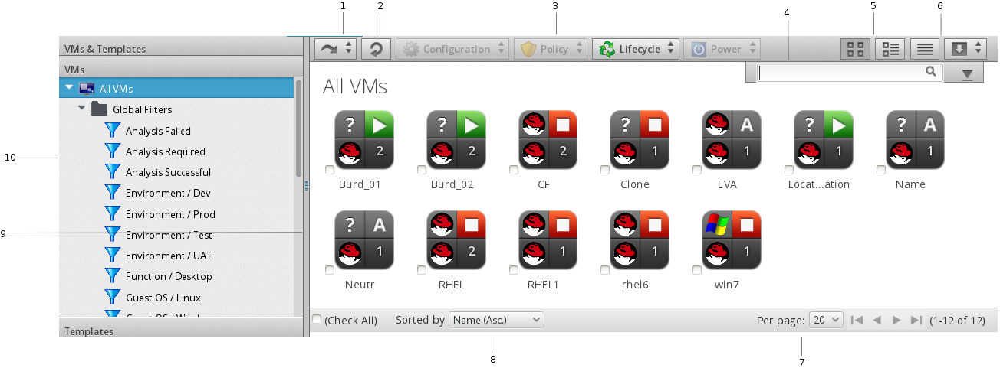
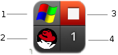
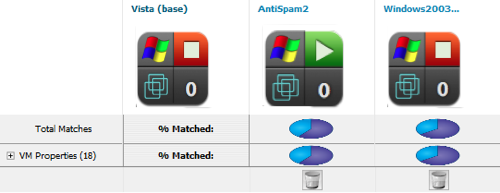

# Virtual Machines

The heterogeneous virtual machine container and guest support combined
with the ability to analyze information inside the virtual machine -
such as disk space, patch level or installed applications - provides
in-depth information across the virtual environment. This rich set of
information enables {{ site.data.product.title_short }} users to improve problem resolution
times and effectively manage virtual machines.

The **Virtual Machines** pages display all virtual machines that were
discovered by your server. Note that if you have applied a filter to a
user, it will be in effect here. The **Virtual Machines** taskbar is a
menu driven set of buttons that provide access to functions related to
virtual machines.

1.  History button

2.  Refresh screen button

3.  Taskbar

4.  Name search bar/Advanced Search button

5.  View buttons

6.  Download buttons

7.  Navigation bar

8.  Sort dropdown

9.  Main area in Grid View

10. Provider/Filter Navigation

The console uses **Virtual Thumbnails** to describe virtual machines and
templates. Each thumbnail contains four quadrants by default. This
allows you to glance at a virtual machine for a quick view of its
contents.

1.  Top left quadrant: Operating system of the Virtual Machine

2.  Bottom left quadrant: Virtual Machine Hosts software

3.  Top right quadrant: Power state of Virtual Machine or Status icon

4.  Bottom right quadrant: Number of Snapshots for this Virtual Machine

| Icon                      | Description                                                                                                                                                                                                                                                                                                                                                                                                                               |
| ------------------------- | ----------------------------------------------------------------------------------------------------------------------------------------------------------------------------------------------------------------------------------------------------------------------------------------------------------------------------------------------------------------------------------------------------------------------------------------- |
|  | Template: Virtual Template                                                                                                                                                                                                                                                                                                                                                                                                                |
|  | Retired: When a virtual machine or instance is no longer required, it can be retired. Once a virtual machine or instance reaches its retirement date and time, it is immediately shut down and not allowed to restart. If an attempt to restart is made, {{ site.data.product.title_short }} will shut down the virtual machine or instance.                                                                                                                  |
|  | Archived: An archived virtual machine has no host or datastore associated with it. Archiving is done to move virtual machines to a low cost storage, either on demand or during retirement, if requested, to avoid incurring extra cost on a virtualized infrastructure due to virtual machine sprawl.                                                                                                                                    |
|  | Orphaned: An orphaned virtual machine has no host but has a datastore associated with it. Orphaned virtual machines are those that have been removed from their providers but still exist on the storage. An orphaned virtual machine is unable to identify the associated host. A virtual machine also shows as orphaned if it exists on a different host than the host expected by the provider’s server.                               |
|  | Disconnected: A disconnected virtual machine is one that has lost connection to either the provider’s storage, host, or both. A disconnect is usually a result of network issues on the provider side. For instance, if during virtual machine provisioning the storage is not set up or deleted, the virtual machine will still exist on the provider, but will not run on the host as it has lost connection to its provider’s storage. |
|  | On: Virtual Machine is powered on.                                                                                                                                                                                                                                                                                                                                                                                                        |
|  | Off: Virtual Machine is powered off.                                                                                                                                                                                                                                                                                                                                                                                                      |
|  | Suspended: Virtual Machine has been suspended.                                                                                                                                                                                                                                                                                                                                                                                            |

The **Virtual Machines** page has three accordions organizing your
virtual machines and templates in different ways. All of these
accordions share a set of common controls:

  - Use **VMs and Templates** to view your virtual machines and
    templates organized by Provider. In addition, you can see archived
    and orphaned items here.

  - Use **VMs** to view, apply filters, and collect information about
    all of your virtual machines.

  - Use **Templates** to view, apply filters, and collect information
    about all of your templates.

Through the console, you are able to view your virtual machines in
multiple ways. For your virtual machines, you can:

  - Filter virtual machines

  - Change views

  - Sort

  - Create a report

  - Search by MyTags

  - Search by collected data

## Filtering Virtual Machines and Templates

The **Virtual Machine Filter** accordion is provided so that you can
easily navigate through groups of virtual machines. You can use the ones
provided or create your own through **Advanced Filtering** capabilities.

1.  Browse to menu: **Compute > Infrastructure > Virtual Machines**.

2.  Go to the **VMs** or **Templates** accordion.

3.  Click on the desired filter from the left pane.













## Analyzing Virtual Machines and Templates

Analyze a virtual machine to collect metadata such as user accounts,
applications, software patches, and other internal information. If
{{ site.data.product.title_short }} is not set up for automatic analysis, perform a manual
analysis of a virtual machine. To perform a SmartState analysis,
{{ site.data.product.title_short }} requires a running SmartProxy with visibility to the
virtual machine’s storage location. If the virtual machine is associated
with a host or provider, ensure the virtual machine is registered with
that system to be properly analyzed; the server requires this
information since a snapshot might be created.

**Note:**

SmartState Analysis of a virtual machine requires access to its host. To perform a successful analysis, edit the virtual machine’s host and enter the host’s authentication credentials.

1.  Browse to menu: **Compute > Infrastructure > Virtual Machines**.

2.  Click the accordion for the items to analyze.

3.  Check the **Virtual Machines** and **Templates** to analyze.

4.  Click **Configuration**, then
     (**Perform SmartState Analysis**).

5.  Click **OK**.

## Red Hat Enterprise Virtualization Prerequisites





## VMware vSphere Prerequisites

### Installing VMware VDDK on {{ site.data.product.title_short }}



## Comparing Virtual Machines and Templates

The {{ site.data.product.title_short }} Server allows you to compare multiple virtual
machines. This allows you to see how different virtual machines are from
their original template. This helps detect missing patches, unmanaged
user accounts, or unauthorized services.

Use the comparison feature to:

  - Compare multiple virtual machines from different hosts.

  - Compare multiple virtual machines side-by-side.

  - Quickly see similarities and differences among multiple virtual
    machines and a base.

  - Narrow the comparison display to categories of properties.

  - Print or export in the comparison results to a PDF or CSV file.

Compare virtual machines and templates:

1.  Browse to menu: **Compute > Infrastructure > Virtual Machines**.

2.  Click the accordion for the items to analyze.

3.  Check the items to compare.

4.  Click **Configuration**, and then
    (**Compare Selected items**). The
    comparison displays in a compressed view with a limited set of
    properties listed.

    

5.  To delete an item from the comparison, click
    (**Remove this item from Inventory**)
    at the bottom of the items column. This option is only available
    when comparing more than two virtual machines.

6.  To view many items on one screen, go to a compressed view by
    clicking  (**Compressed View**). To
    return to an expanded view, click 
    (**Expanded View**).

7.  To limit the mode of the view, there are two buttons in the task
    bar.

      - Click  (**Details Mode**) to see
        all details for an attribute.

      - Click  (**Exists Mode**) to limit
        the view to if an attribute exists compared to the base or not.
        This only applies to attributes that can have a boolean
        property. For example, a user account exists or does not exist,
        or a piece of hardware that does or does not exist.

8.  To change the base virtual machine that all the others are compared
    to, click its label at the top of its column.

9.  To go to the summary screen for a virtual machine, click its
    **Virtual Thumbnail** button or icon.






































































