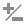

[[_sect_hosts]]
= Hosts

The *Hosts* page under *Infrastructure* displays the hosts discovered in your enterprise environment.

[NOTE]
======
Any applied filters will be in effect here.
======

image::images/2212.png[]

After adding or sorting your hosts, click on one to examine it more closely and see its virtual machines, SmartProxy settings, and properties.

image::images/2222.png[]

. Top left quadrant: Number of virtual machines on this host
. Bottom left quadrant: Virtual machine software
. Top right quadrant: Power state of host
. Bottom right quadrant: Authentication status

[cols="1,1", frame="all", options="header"]
|===
|

								Icon

|

								Description

|

image:images/2190.png[]

|

								Validated: Valid authentication credentials have been added.

|

image:images/2191.png[]

|

								Invalid: Authentication credentials are invalid

|

image:images/2192.png[]

|

								Unknown: Authentication status is unknown or no credentials have been entered.

|===

:leveloffset: 2
[[_sect_filtering_hosts]]
= Filtering Hosts

The Host Filter accordion is provided to easily navigate through the hosts.
Use the ones provided or create your own.
In addition, you can set a default filter.

:leveloffset: 3
include::topics/To_set_a_default_Host_Filter.adoc[]

:leveloffset: 3
include::topics/To_create_a_Host_Filter.adoc[]

:leveloffset: 2
include::topics/Performing_SmartState_Analysis_on_Hosts.adoc[]

:leveloffset: 2
[[_sect_comparing_hosts]]
= Comparing Hosts

{product-title} allows you to compare hosts and check operating systems, host software and version information, and hardware.
. Navigate to menu:Infrastructure[Hosts].
. Check the hosts to compare.
. Click  image:images/1847.png[] (*Configuration*), and then  image:images/2148.png[] (*Compare selected Hosts*).
  The comparison displays in a default expanded view, which lists a limited set of properties.
. To remove a host from the comparison, click  image:images/1861.png[] (*Remove this Host from the comparison*) at the bottom of the column.
. To go to a compressed view, click  image:images/2024.png[] (*Compressed View*).
  To return to an expanded view, click  image:images/2023.png[] (*Expanded View*).
. To limit the mode of the view, there are two buttons in the taskbar.
+
* Click  image:images/2022.png[] (*Details Mode*) to see all details for an attribute.
* Click   (*Exists Mode*) to limit the view to if an attribute exists compared to the base or not.
  This only applies to attributes that can have a Boolean property.
  For example, a user account exists or does not exist, or a piece of hardware that does or does not exist.

. To change the base host that compare to the other hosts, click its label at the top of its column.
. To go to the summary screen for a host, click its Virtual Thumbnail or icon.

:leveloffset: 3
include::topics/Host_Comparison_Sections.adoc[]

:leveloffset: 3
include::topics/To_use_Host_Comparison_Sections.adoc[]

:leveloffset: 3
include::topics/To_create_a_comparison_report2.adoc[]

:leveloffset: 2
include::topics/Refreshing_Multiple_Hosts.adoc[]

:leveloffset: 2
include::topics/Discovering_Multiple_Hosts.adoc[]

:leveloffset: 2
include::topics/Adding_a_single_Host.adoc[]

:leveloffset: 2
include::topics/Editing_Hosts.adoc[]

:leveloffset: 2
include::topics/Reviewing_a_Host.adoc[]

:leveloffset: 2
include::topics/Tagging_Multiple_Hosts.adoc[]

:leveloffset: 2
include::topics/Removing_Hosts.adoc[]

:leveloffset: 2
include::topics/Refreshing_Relationships_and_Power_States_for_a_Host.adoc[]

:leveloffset: 2
include::topics/Viewing_Capacity_and_Utilization_Charts_for_a_Host.adoc[]

:leveloffset: 2
include::topics/Viewing_the_Host_Timeline.adoc[]

:leveloffset: 2
include::topics/Host_Virtual_Summary.adoc[]

:leveloffset: 2
include::topics/Viewing_Host_Device_Information.adoc[]

:leveloffset: 2
include::topics/Viewing_Host_Network_Information.adoc[]

:leveloffset: 2
include::topics/Viewing_Storage_Adapters.adoc[]

:leveloffset: 2
include::topics/Detecting_Drift_on_Hosts.adoc[]

:leveloffset: 2
include::topics/To_create_a_drift_report2.adoc[]
