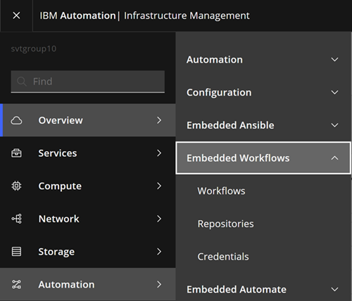
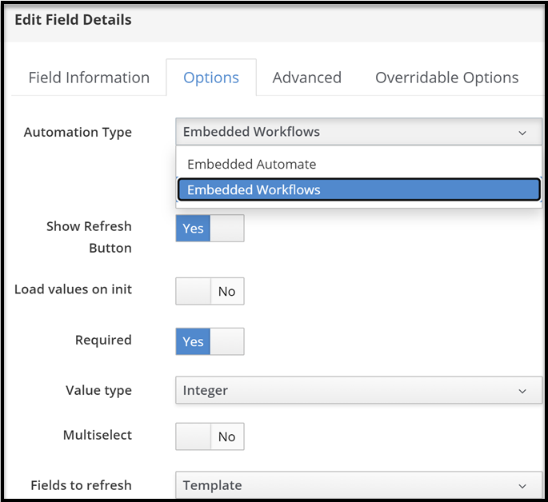
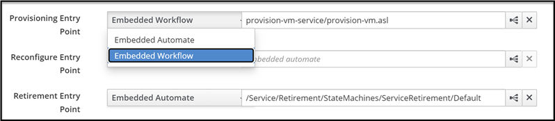
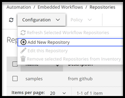
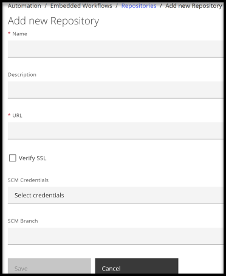
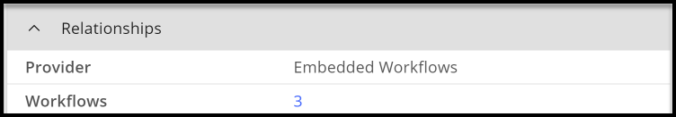
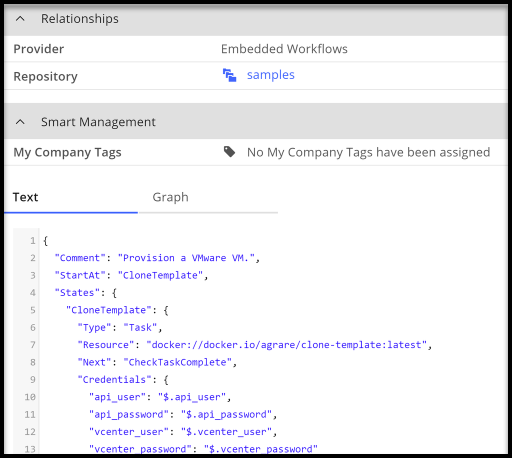
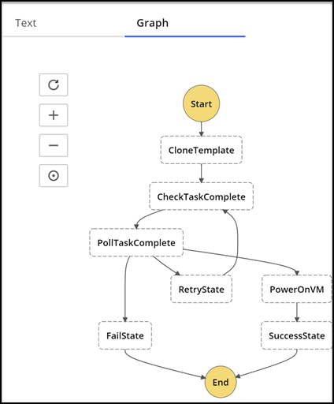
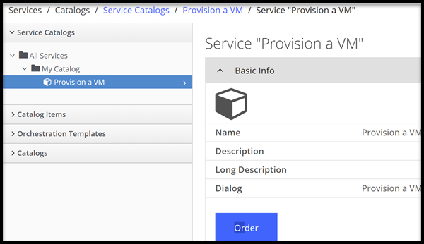
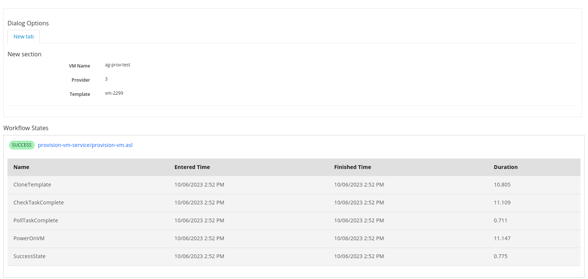

## Embedded Workflows

*Embedded Workflows* provide the capability to simplify service catalog creation and improve the overall service catalog experience through a step-based automation system. Workflows can run docker containers to accomplish a task that the user requires as part of the state machine. Workflows are imported from Git repository content into {{ site.data.product.title_short }} where they are made available for users to run.

*Embedded Workflows* are an alternative to the *Embedded Automate* capability for authoring and running automation. With *Embedded Workflows*, you can continue to use the *Embedded Automate* feature for service catalog creation and management.

### Embedded Workflows UI

For the *Embedded Workflows* feature, the following pages are available in the UI, which you can use to access and work with workflows. To view these pages, go to **Automation** > **Embedded Workflows** and select the page.



- **Workflows**

   This UI page includes a summary of the available workflows. You can use different views to review the workflows:

   - Text view, which is the raw representation (JSON or YAML) of the Amazon State Languages (ASL) code.
   - Graph view, which shows a visual representation of the workflow structure.

- **Repositories**

   This page lists, and provides a summary of, the added embedded workflow repositories. From this page, you can add, update, and remove repositories.
   When a repository is added and synchronized, any workflows that are found in the repository can be viewed on the **Workflows** UI page.

- **Credentials**

   Credentials are used by {{ site.data.product.title_short }} for any authentication that is required when running embedded workflows, and when importing workflows from a version control system.

   This page lists, and provides a summary of, the credentials for accessing and using embedded workflows. From this page, you can add, update, and delete credentials.

In addition to the *Embedded Workflows* UI, **Embedded Workflows** can also be used in Service Dialogs for dynamic dialog fields and with Service Catalog Items for provisioning, reconfiguration, and retirement entrypoints.

* Service Dialog

   When creating a service dialog, fields that are dynamic include the option for using **Embedded Workflows** or **Embedded Automate**.

   

* Service Catalog Items

   The provisioning, reconfigure, and retirement entry points include the option for using **Embedded Workflows** or **Embedded Automate**.  You can set the point field to the workflow that you want to use for any, or all, of the three service entry points.

   

### Adding an Embedded Workflows Repository

As a starting point to begin using workflows, you must first add a repository that includes your workflows.

To add a repository, complete the following steps:

1. Click  **Automation** > **Embedded Workflows** > **Repositories** > **Configuration** > **Add New Repository**.

   

2. Enter the repository name in the **Name** field.

3. Add a description for the repository in the **Description** field.

4. Enter a Git repository URL for the repository in the **URL** field. The Git repository URL does not need to be a GitHub repository.

6. If you are adding a repository that requires authentication then add an SCM (Source Control Management) credential for accessing the repository. Select that credential for this repository from the **SCM Credentials** dropdown menu. These credentials are used in different ways within embedded workflows.

   Source Control credentials have several attributes that can be configured:

   - **Username**: The username to use in conjunction with the source control system.
   - **Password**: The password to use in conjunction with the source control system.
   - **Private key passphrase**: If the SSH private key used is protected by a passphrase, you can configure a key passphrase for the private key.
   - **Private Key**: Copy or drag and drop the actual SSH Private Key to be used to authenticate the user to the source control system by using SSH.

7. Provide a branch name in the **SCM Branch** field for the branch that you want to pull.

8. Click **Save**. Upon saving, the repository is imported and scanned for any included workflows (any Amazon States Language `.asl` files).

   

9. Confirm that the synchronization with your repository is successful by viewing the list of workflows that are detected for the repository.

To view the added repositories, return to the **Automation** > **Embedded Workflows** > **Repositories** page. The list of repositories is displayed. To view a summary of details for a repository, click the repository to open the *Summary* page for that repository.

If you need to edit a repository, select the repository from the list of repositories. Then, click **Configuration** > **Edit this Repository**. After you complete your edits, click **Save**.

If you need to delete a repository, select the repository from the list of repositories. Then, click **Configuration** > **Remove this Repository from Inventory**.

### Viewing the List of Workflows in a Repository

When your repository is added, the repository shows in the *Repositories* list. You can now click the entry for the repository to open it so that you can view the imported workflows.
If any workflows are found, click the corresponding number to view the list of workflows.

   

Alternatively, click **Automation** > **Embedded Workflows**. Then, click **Workflows** to see the list of workflows across all repositories.

### Refreshing Repositories

{{ site.data.product.title_short }} allows you to refresh a targeted repository or all repositories in your inventory to ensure that your workflows are current.

Refresh a targeted repository:

1.  Browse to the menu: **Automation** > **Embedded Workflows** > **Repositories**.

2.  Click a repository.

3.  Click **Configuration**, then  (**Refresh this Repository**).

Alternately, you can refresh some or all repositories from the list view:

1.  Browse to the menu: **Automation** > **Embedded Workflows** > **Repositories**.

2.  Check those repositories to refresh. Click **Check All** to select all repositories.

3.  Click **Configuration**, then (**Refresh Selected Workflow Repositories**).

### Adding Credentials

Credentials are used by {{ site.data.product.title_short }} for any authentication that is required when running embedded workflows, or when importing workflows from a version control system.

{{ site.data.product.title_short }} can store credentials that are used by embedded workflows. Credentials that are saved in {{ site.data.product.title_short }} are mapped to values in the `Credentials` field of your Workflow and are made available to the container with a workflow when the workflow runs.

1.  Browse to the menu: **Automation** > **Embedded Workflows** > **Credentials**.

2.  Click **Configuration**, then  (**Add New Credential**).

3.  Provide a **Name** for the credential.

4.  Select the **Credential Type**. More fields appear depending on the type chosen.

5.  Click **Add**.

To view the added credentials, return to the **Automation** > **Embedded Workflows** > **Credentials** page. The list of credentials is displayed. To view a summary of details for a credential, click the credential to open the *Summary* page for that credential.

If you need to edit a credential, select the credential from the list of credentials. Then, click **Configuration** > **Edit this Credential**. After you complete your edits, click **Save**.

If you need to delete a credential, select the credential from the list of credentials. Then, click **Configuration** > **Remove selected Credentials from Inventory**.

#### Credential Types

Each credential type that is used by {{ site.data.product.title_short }} for embedded workflows is detailed in the following sections.

##### SCM

SCM (source control Management) credentials are used with Projects to clone and update local source code Git repositories. Source Control credentials have several attributes that can be configured:

- **Username**: The username to use in conjunction with the source control system.

- **Password**: The password to use in conjunction with the source control system.

- **Private key passphrase**: If the SSH private key used is protected by a passphrase, you can configure a key passphrase for the private key.

- **Private Key**: Copy or drag-and-drop the actual SSH Private Key to be used to authenticate the user to the source control system by using SSH.

### Authoring a workflow

You can configure workflows for use in the following areas during service catalog creation:

- **Dynamic dialog fields** - You (or your users) can attach workflows to a field so that the field becomes populated or refreshed with the results from the running of the workflow.
- **Service Entry Points** - You (or your users) can set and use workflows for provisioning, reconfiguring, and retiring services.

You can create and use embedded workflows as needed to not only change parts of the provisioning process, but also to automate other operational tasks.

Workflows must be authored in Amazon State Languages (ASL) format. As part of authoring a workflow, you (or your users) can build container images that are able to perform any tasks that are required in any language that you like. You can use these images during Task states in your workflows.

1. Define the code for the workflow. If your workflow requires the use of any credentials or parameters to be specified, ensure that they are passed in the code.

   Within the workflow code, you need to specify the states that your workflow requires, including any next steps. For `Task` type steps in the workflow, a docker container is called. The container defines what happens for that Task state. For example, a docker container can run to clone a template. If your states require parameters or credentials, you can specify them in your state definitions.

   The workflow code must be in the Amazon States Language (ASL) format and follow its supported specifications. For more information about Amazon States Language and its specification, see [Amazon States Language Guide](https://states-language.net/).

2. Build the docker containers that are required for the workflow.

   When you have the code for your task resource written, you need to bundle it into a docker image. You can bundle the code by creating a standard [Dockerfile](https://docs.docker.com/engine/reference/builder/) and building the image (https://docs.docker.com/engine/reference/commandline/build/). Then, you can push the image to a [registry](https://docs.docker.com/engine/reference/commandline/push/), which makes the image available to be used by {{ site.data.product.title_short }}. When you have pushed your images to an image registry, you can add the registry to {{ site.data.product.title_short }}.

   On appliances, `podman` is used to execute the container, so use [podman login](https://docs.podman.io/en/stable/markdown/podman-login.1.html) as the `manageiq` user.

     ```
     # su manageiq
     $ podman login docker.io
     Username:
     Password:
     Login Succeeded!
     ```

   You are recommended to use a docker.io [access token](https://docs.docker.com/security/for-developers/access-tokens/) so that the token does not expire.

#### Example: Provisioning Workflow

```asl
{
  "Comment": "Provision a VMware VM.",
  "StartAt": "CloneTemplate",
  "States": {
    "CloneTemplate": {
      "Type": "Task",
      "Resource": "docker://docker.io/manageiq/workflows-examples-clone-template:latest",
      "Next": "CheckTaskComplete",
      "Credentials": {
        "api_user.$": "$.api_user",
        "api_password.$": "$.api_password",
        "vcenter_user.$": "$.vcenter_user",
        "vcenter_password.$": "$.vcenter_password"
      },
      "Parameters": {
        "PROVIDER_ID.$": "$.dialog_provider",
        "VERIFY_SSL": false,
        "TEMPLATE.$": "$.dialog_source_template",
        "NAME.$": "$.dialog_vm_name"
      }
    },

    "CheckTaskComplete": {
      "Type": "Task",
      "Resource": "docker://docker.io/manageiq/workflows-examples-check-task-complete:latest",
      "Next": "PollTaskComplete",
      "Credentials": {
        "vcenter_user.$": "$.vcenter_user",
        "vcenter_password.$": "$.vcenter_password"
      },
      "Parameters": {
        "VCENTER_HOST.$": "$.vcenter_host",
        "TASK.$": "$.task"
      }
    },

    "PollTaskComplete": {
      "Type": "Choice",
      "Choices": [
        {
          "Variable": "$.state",
          "StringEquals": "success",
          "Next": "PowerOnVM"
        },
        {
          "Variable": "$.state",
          "StringEquals": "running",
          "Next": "RetryState"
        },
        {
          "Variable": "$.state",
          "StringEquals": "error",
          "Next": "FailState"
        }
      ],
      "Default": "FailState"
    },

    "RetryState": {
      "Type": "Wait",
      "Seconds": 5,
      "Next": "CheckTaskComplete"
    },

    "PowerOnVM": {
      "Type": "Task",
      "Resource": "docker://docker.io/manageiq/workflows-examples-power-on-vm:latest",
      "Next": "SuccessState",
      "Credentials": {
        "vcenter_user.$": "$.vcenter_user",
        "vcenter_password.$": "$.vcenter_password"
      },
      "Parameters": {
        "VCENTER_HOST.$": "$.vcenter_host",
        "VM.$": "$.vm"
      }
    },

    "FailState": {
      "Type": "Fail",
      "Error": "FailStateError",
      "Cause": "No Matches!"
    },

    "SuccessState": {
      "Type": "Succeed"
    }
  }
}
```

### Viewing workflow details

Once a workflow is imported, you can view the details, such as to verify the payload. To view the details for a workflow:

1. Go to the menu: **Automation** > **Embedded Workflows**. Then, click **Workflows** to see the workflows list.

2. Click a workflow. The default *Text* view of the workflow opens where you see the code content.

   

   Alternatively, click the **Graph** tab to see a graph of the same data.

   

3. If your workflow has credential fields, create a workflow credential for each of the fields. For more information about creating a credential, see [Adding Credentials](#adding-credentials).

4. Map any workflow credentials to the workflow.

   1. Go to the menu: **Automation** > **Embedded Workflows**. Then, click **Workflows** to see the workflows list.

   2. Select the workflow that includes the credentials that you need to map.

   3. Click **Configuration** > **Map Credentials to this Workflow**.

      The table that displays on the *Map Credentials* page displays all the current mappings for the selected workflow. Verify that the list of credential identifiers includes all of the identifiers that are in the workflow payload.

   4. Use the drop-down fields to map one or more credentials for the workflow. Verify that the table is updated with the correct information.

   5. Click **Save**.

### Creating a Service Dialog using an Embedded Workflow

Fields that are *Dynamic* offer the choice of *Embedded Workflows* in addition to the original *Embedded Automate*.

Dialogs are the part of {{ site.data.product.title_short }} that you interface with when you order services.

1. To open a service dialog, click **Automation** > **Embedded Automate** > **Customization**.
2. From the *Service Dialog* section, review the list of created dialogs. Click one of the dialogs to view the details.
3. Click **Edit the dialog**. You can edit the *Name*, *Provider*, and *Template*.

   When you select to edit any of the dropdown settings, you can see a *dynamic* option. Toggle to **On** to make sure it is enabled.

4. Click the **Options** tab. You can now select between *Embedded Automate* and *Embedded Workflows* in the Automation field.

   

   If you choose **Embedded Workflows**, you can select the workflow to run. Complete the remaining fields and click **Save** when you complete the form. You can chain dialog fields together by using **Fields to refresh**, which lets one dialog field trigger the run of another when there are interdependencies. When you *order* a service catalog, any dynamic dialogs that are backed by embedded workflows run in the background to populate the dialogs.

### Creating Service Catalog Items using an Embedded Workflow

You can create a generic service catalog item that uses an embedded workflow. To use previously set up workflows and to view a service catalog item, you need to *order* the item. Complete the following steps to order a service catalog item that uses embedded workflows:

1. Click **Services** > **Catalogs**.
2. The *Service Catalogs* section opens and you see the existing Service Catalogs. If you want to order one, click it and then **Order**.

   

   Complete the fields for your specified dialog. Then, click **Submit**.

3. If you want to know more about the item first or to edit it, click the **Catalogs** section, and then click that item that is created. Click **Configuration** > **Edit this item**.

   

4. When you complete all your edits, click **Save**.
5. Confirm that you can order the service catalog item and that it runs the workflows to drive the dynamic dialog dropdown.

   The list of services and requests is shown when the catalog item is submitted. Clicking the request shows the execution status, including any embedded workflows.

   
