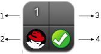

# Infrastructure Providers

In {{ site.data.product.title }}, an infrastructure provider is a virtual
infrastructure environment that you can add to a {{ site.data.product.title_short }}
appliance to manage and interact with the resources in that environment.
This chapter describes the different types of infrastructure providers
that you can add to {{ site.data.product.title_short }}, and how to manage them.
Infrastructure providers can be either discovered automatically by
{{ site.data.product.title_short }}, or added individually.

The web interface uses virtual thumbnails to represent infrastructure
providers. Each thumbnail contains four quadrants by default, which
display basic information about each provider:

1.  Number of hosts

2.  Management system software

3.  Currently unused

4.  Authentication status

| Icon                      | Description                                                                    |
| ------------------------- | ------------------------------------------------------------------------------ |
|  | Validated: Valid authentication credentials have been added.                   |
|  | Invalid: Authentication credentials are invalid.                               |
|  | Unknown: Authentication status is unknown or no credentials have been entered. |

Provider authentication status





## Red Hat Virtualization Providers

To use a Red Hat Virtualization provider, add it to the appliance and
authenticate its hosts. You can also configure capacity and utilization
data collection to help track usage and find common issues.







## OpenStack Infrastructure Providers

Enable an OpenStack Infrastructure provider by adding it to the
appliance.





## VMware vCenter Providers

To use a VMware vCenter provider, add it to the appliance and
authenticate its hosts.







## Microsoft SCVMM Providers

To use a Microsoft System Center Virtual Machine Manager (SCVMM)
provider, add it to the appliance and set up the SCVMM server for
authentication.

**Note:**

To use a SCVMM provider, you must have at least one network adapter
available for communication between the host and the SCVMM management
server. Make sure that **Used by Management** is checked for this
network adapter in the SCVMM host properties.


















