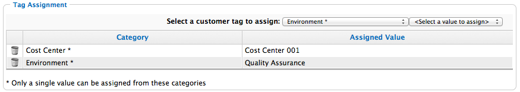

# Tagging Cloud Providers

Apply tags to all cloud providers to categorize them together at the
same time.

1.  Navigate to **Compute > Clouds > Providers**.

2.  Select the checkboxes for the Cloud Providers to tag.

3.  Click  (**Policy**), and then  (**Edit Tags**).

4.  Select a customer tag to assign from the first list.

    

5.  Select a value to assign from the second list.

6.  Click **Save**.
