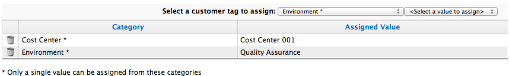

# Tagging Multiple Providers

Apply tags to all providers to categorize them together at the same time.

1. Browse to menu: **Infrastructure > Providers**.

2. Check the providers to tag.

3. Click  **Policy**, and then
    **Edit Tags**.

4. In the **Tag Assignment** area, select a customer tag to assign from
   the first list, then select a value to assign from the second list.

    

5. Select more tags as required; click **Save**.
