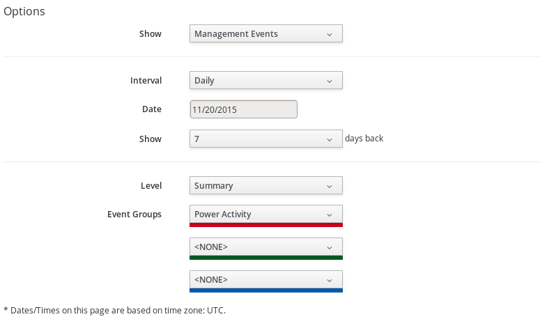

# Viewing the Provider Timeline

View the timeline of events for the virtual machines registered to a
provider.

1.  Navigate to menu:Compute\[Infrastructure \> Providers\].

2.  Click a provider.

3.  Click  (**Monitoring**), and then
     (**Timelines**)from the taskbar, or
    from the provider accordion, click menu:Properties\[Timeline\].

4.  From **Options**, customize the period of time to display and the
    types of events to see.

    

      - Use **Show** to select regular Management Events or Policy
        Events.

      - Use the **Interval** dropdown to select hourly or daily data
        points.

      - Use **Date** to type the date for the timeline to display.

      - If you select to view a daily timeline, use **Show** to set how
        many days back to go. The maximum history is 31 days.

      - The three **Event Groups** lists allow you to select different
        groups of events to display. Each has its own color.

      - From the **Level** list, select a **Summary** event, or a
        **Detail** list of events. For example, the detail level of a
        **Power On** event might include the power on request, the
        starting event, and the actual **Power On** event. If you select
        **Summary**, only the Power On event displays in the timeline.
