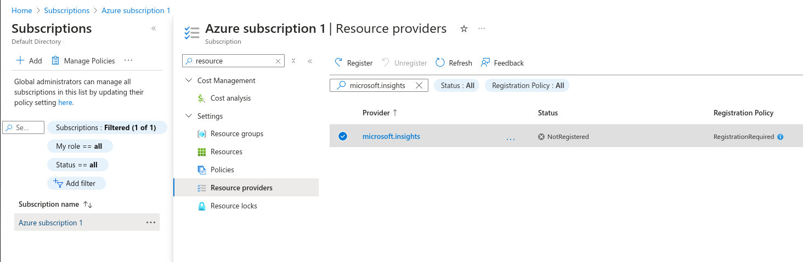

## Adding Azure Providers

{{ site.data.product.title_short }} supports Microsoft Azure providers. Before
{{ site.data.product.title_short }} can be authenticated to Microsoft Azure, you must
complete a series of prerequisite steps using the Azure portal. For more information, see
[Create Active Directory application and service principal account using
the Azure
portal](https://azure.microsoft.com/en-us/documentation/articles/resource-group-create-service-principal-portal/).

Follow the steps to set up an Azure Active Directory (Azure AD) and
assign the required permissions to it, then create an Azure Active
Directory application, and obtain the **Application ID** (Client ID),
**Directory ID** (Tenant ID), **Subscription ID**, and **Key Value**
(Client Key) that are required to add and connect to the Azure instance
as a provider in {{ site.data.product.title_short }}. Currently, all of these steps
can be performed using either the Azure Resource Manager or Service
Manager (Classic) mode.

**Note:**

In the steps described in [Create Active Directory application and service principal account using the Azure portal](https://azure.microsoft.com/en-us/documentation/articles/resource-group-create-service-principal-portal/):

- The **Application ID** obtained during *Get Application ID and
    Authentication Key* is your **Client ID**. In the same section,
    after providing a description and a duration for the key, the
    **VALUE** displayed after clicking **Save** is your **Client Key**.
    If you choose an expiring key, make sure to note the expiration
    date, as you need to generate a new key before that day in
    order to avoid an interruption.

- The **Directory ID** obtained during *Get Tenant ID* is your
    **Tenant ID**. In Azure Active Directory (Azure AD), a tenant is a
    dedicated instance of the Azure AD service and is representative of
    an organization. It houses the users in a company and the
    information about them - their user profile data, permissions,
    groups, applications, and other information related to an
    organization and its security. To allow Azure AD users to sign in to
    your application, you must register your application in a tenant of
    your own which is assigned a Tenant ID (Directory ID).

- During *Assign Application to Role*, select the **Contributor** role
    and not the **Reader** role.

- To obtain your **Subscription ID**, log in to the Azure portal and
    click **Subscriptions** on the slide-out menu. Find the
    appropriate subscription and see your Azure **Subscription ID**
    associated with it. Note that if the **Subscriptions** tab is not
    visible, then click on **More services** to find it. The Azure
    **Subscription ID** is like a billing unit for all of the services
    consumed in your Azure account, including virtual machines and
    storage. The **Subscription ID** is in the form of a Globally Unique
    Identifier (GUID).

When the service principal account (instance of an application in a directory) is created using the Azure portal, the following four pieces of information becomes available within the Azure AD module.

- Directory ID (Tenant ID)
- Subscription ID
- Application ID (Client ID)
- Client Key

You can now use these values in the procedure below to add an Azure cloud instance as a provider to {{ site.data.product.title_short }}.

To capture Events or Capacity and Utilization metrics from your Azure account
you need to register the Microsoft Insights resource provider.

1. Select your subscription, and click **Resource providers**.
2. Enter **microsoft.insights** in the search box.
3. If the provider isn't registered, then select the checkbox, and click **Register**.

**Add an Azure Cloud Provider**:

1.  Browse to the menu and click **Compute** > **Clouds** > **Providers**.

2.  Click **Configuration**, then click
     (**Add a New Cloud Provider**).

3.  Enter a **Name** for the provider.

4.  From the **Type** list, select **Azure**.

5.  Select a region from the **Region** list. One provider will be
    created for the selected region.

6.  Enter **Tenant ID**.

7.  Enter **Subscription ID**.

8.  Enter **Zone**.

9.  In the **Credentials** section, enter the **Client ID** and **Client
    Key**; click **Validate**.

10. Click **Add**.
