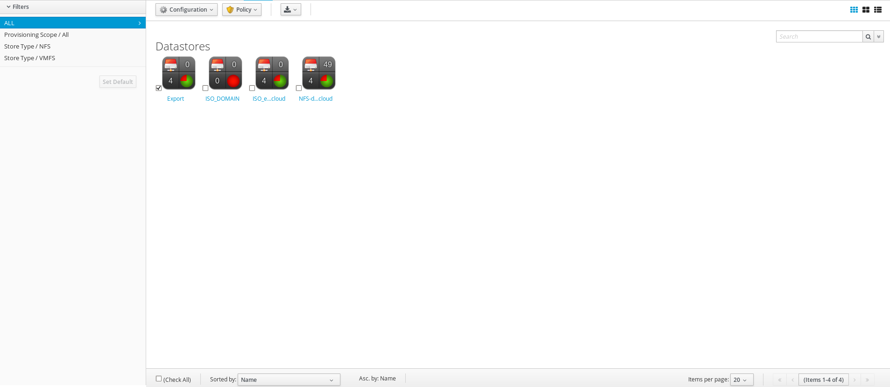
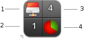

[[_sect_datastores]]
= Datastores

A storage location is considered a device where digital information resides and is connected to a resource.
CloudForms Management Engine detects, analyzes, and collects capacity and utilization data for both VMFS and NFS datastores.
Datastores connected to a provider are automatically created on discovery.
On creation of a repository, a datastore is automatically created. 

After detecting datastores, you might want to examine them more closely to see virtual machines, hosts, and available space. 

. Top left quadrant: File system type 
. Bottom left quadrant: Number of hosts 
. Top right quadrant: Number of virtual machines 
. Bottom right quadrant: Available space 

:leveloffset: 2
include::topics/Performing_SmartState_Analysis_on_Datastores.adoc[]

:leveloffset: 2
include::topics/Reviewing_a_Datastore.adoc[]

:leveloffset: 2
include::topics/Tagging_a_Datastore.adoc[]

:leveloffset: 2
include::topics/Viewing_Capacity_and_Utilization_Charts_for_a_Datastore.adoc[]

:leveloffset: 2
include::topics/Removing_a_Datastore.adoc[]

