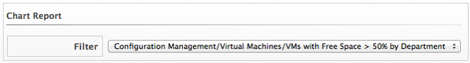
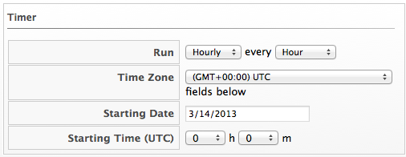

### Creating a Chart Widget

1.  Navigate to **Overview > Reports**.

2.  Click the **Dashboard Widgets** accordion and click the **Charts**
    folder.

3.  Click  **(Configuration)**, then click
     **(Add a new Widget)**.

4.  In the **Basic Information** area, type in a **Title** and
    **Description**. By default the widget will be active as soon as you
    create it. To make it inactive, uncheck the **Active** box.

5.  From the **Chart Report** area, select a chart to display in the
    widget.

    

6.  In the **Timer** area, click the **Run** drop down to specify how
    often you want the widget data to get updated. The options displayed
    will depend on which **Run** option you choose. Select **Hourly**,
    **Daily**, **Weekly**, or **Monthly**.

    

7.  Select a **Time Zone**. Type or select a date to begin the schedule
    in **Starting Date**. Select a **Starting Time** based on a 24 hour
    clock in the selected time zone.

    **Note:**

    If you change the time zone, you will need to reset the starting
    date and time.

8.  In the **Visibility** area, select **\<To All Users\>**, so that all users can use this widget no matter what user role they are assigned. Select **\<By Role\>** to assign this widget to specific user roles. Select **\<By Group\>** to assign this widget to specific groups.

9.  Click **Add**.
