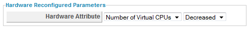

### Creating a Hardware Reconfigured Alert

Use a hardware reconfigure alert to detect changes to the amount of
memory or the number of CPUs on a virtual machine.

1.  Browse to menu: **Control > Explorer**.

2.  Click the **Alerts** accordion, then click
    **Configuration**,  (**Add a new
    Alert**).

3.  In the **Info** area:

      - Type in a description for the alert.

      - From **Based On**, select **VM and Instance**.

      - From **What to Evaluate**, select **Hardware Reconfigured**.

      - In **Notification Frequency**, select how often you want to be
        notified if hardware reconfiguration is detected.

4.  From **Hardware Attribute**, select Number of CPUs. From the next
    dropdown, select **Decreased**.

    

5.  After setting the parameters, select what you want the alert to do.
    You can send an email, create an SNMP Trap, or send a management
    event to start an automation process.

6.  Click **Add**.
