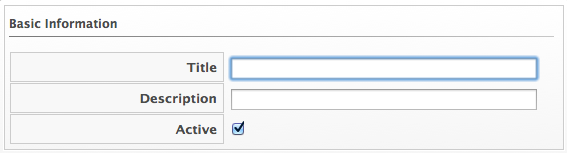

### Creating a Menu Widget

1.  Browse to menu: **Overview > Reports**.

2.  Click the **Dashboard Widgets** accordion and click the **Menus**
    folder.

3.  Click **Configuration**, then click
     (**Add a new Widget**).

4.  In the **Basic Information** area, type in a **Title** and
    **Description**. By default the widget will be active as soon as you
    create it. To make it inactive, uncheck the **Active** box.

    

5.  In the **Menu Shortcuts** area, use the **Add a Shortcut** dropdown
    to select all the places in the console that you want to add to this
    widget.

6.  In the **Visibility** area, select **\<To All Users\>**, so that all
    users can use this widget no matter what user role they are
    assigned. Select **\<By Role\>** to assign this widget to specific
    user roles. Select **\<By Group\>** to assign this widget to
    specific groups.

7.  Click **Add**.
