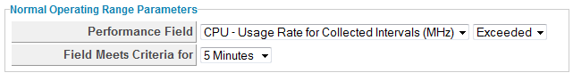

### Creating a Normal Operating Range Alert

Normal operating range alerts enables you to be notified when the normal
operating range is exceeded, or falls below for a period of time from 1
minute to 2 hours. Capacity and utilization must be enabled for normal
operating ranges to be calculated. See *General Configuration* for more
information.

1.  Navigate to menu:Control\[Explorer\].

2.  Click the **Alerts** accordion, then click 
    (**Configuration**),  (**Add a new
    Alert**).

3.  In the **Info** area:

      - Type in a **Description** for the alert.

      - From **Based On**, select **VM and Instance**.

      - For **What to Evaluate**, select **Normal Operating Range**.

      - In **Notification Frequency**, select how often you want to be
        notified if the performance threshold is reached.

4.  Set the threshold in the **Normal Operating Range Parameters** area.

    

      - From **Performance Field**, select the field to check and
        whether you want to be notified if the field is exceeded or fell
        below.

      - In **Field Meets Criteria for**, select the amount of time that
        the threshold requires to be met to trigger the alert.

5.  After setting the parameters, you then select what you want the
    alert to do. You can send an email, create an SNMP Trap, or send a
    management event to start an automation process. See
    [Creating an Alert](../monitoring_alerts_and_reporting/index.html#creating-an-alert).

6.  Click **Add**.
