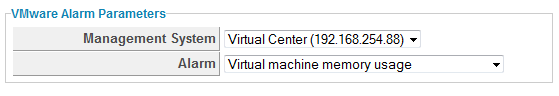

### Creating a VMware Alarm Alert

{{ site.data.product.title_short }} can use VMware alarms as a trigger for an alert. This
type of alert can be created for a cluster, host, or virtual machine.

1.  Navigate to **Control > Explorer**.

2.  Click the **Alerts** accordion, then click 
    (**Configuration**),  (**Add a new
    Alert**).

3.  In the **Info** area:

      - Type in a description for the alert.

      - From **Based On**, select **Cluster**, **Host**, or **VM**.

      - For **What to Evaluate**, select **VMware Alarm**.

      - In **Notification Frequency**, select how often you want to be
        notified if the log item is detected.

4.  In the **VMware Alarm Parameters** area select the provider and
    alarm.

    

5.  After setting the parameters, you then select what you want the
    alert to do. You can send an email, create an SNMP Trap, or send a
    management event to start an automation process.

6.  Click **Add**.
