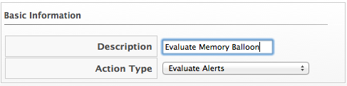
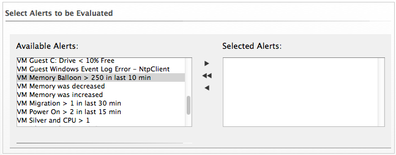

### Evaluating an Alert

1. Browse to menu: **Control > Explorer**.

2. Click the **Actions** accordion, then click **Configuration**,  **Add a new Action**.

3. Type in a **Description** for the action.

    

4. Select **Evaluate Alerts** from **Action Type**.

5. Select the alerts to be evaluated and click  **Move selected Alerts into this Action**. Use the `Ctrl` key to select multiple alerts.

    

6. Click **Add**.
