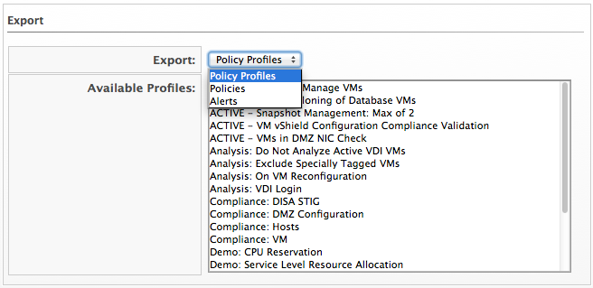

### Exporting a Policy, Policy Profile, or an Alert

1. Browse to menu: **Control > Import/Export**.

2. From the **Export dropdown**, select policy profiles, policies, or alerts, depending on what you want to export.

    

3. From the **Available Profiles** or **Available Policies** or **Available Alerts** list, select the items to export. Use the `Ctrl` key to select multiple items to export into one file.

4. Click **Export**.

5. Follow the prompts in your browser to save the file.
