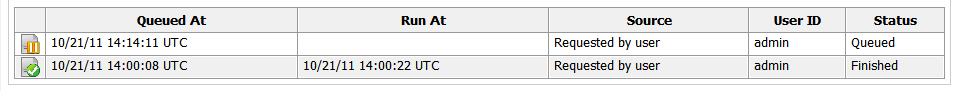

#### Generating a Single Report

1.  Browse to menu: **Overview > Reports**.

2.  Click the menu: **Reports > All Reports** accordion. Navigate to the
    report you want to view by selecting the appropriate folder.

3.  Click  (**Queue**).

4.  The report generation is placed on the queue and its status shows in
    the reports page.

    

5.  Click  (**Reload current display**) to
    update the status.

6.  When a report has finished generating, click on its row to view it.
