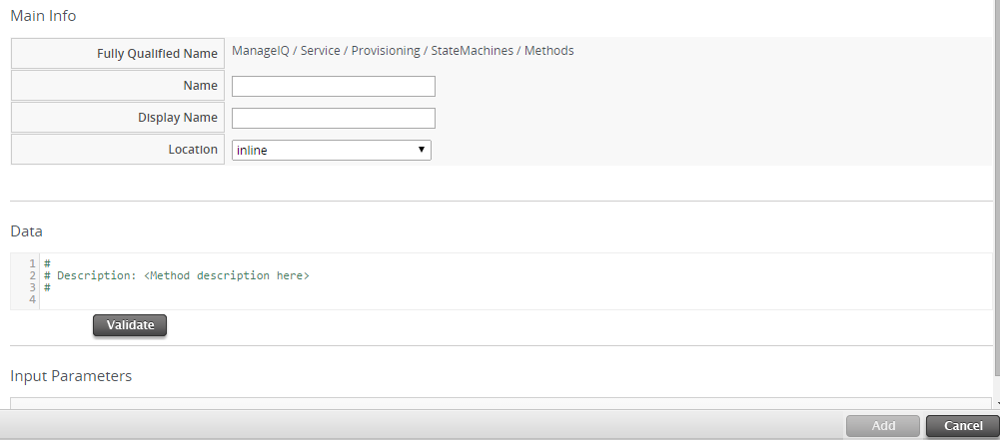
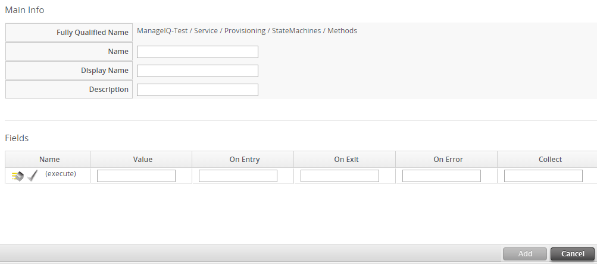

## Catalogs and Services

Through the use of catalogs, {{ site.data.product.title }} provides support for
multi-tier service provisioning to deploy layered workloads across
hybrid environments. You can create customized dialogs that will give
consumers of the services the ability to input just a few parameters and
provision the entire service. The following table lists the terminology
associated with catalogs that you will use within the
{{ site.data.product.title_short }} user interface for service provisioning.

| Type                 | Information                                                                                                                                                                                             |
| -------------------- | ------------------------------------------------------------------------------------------------------------------------------------------------------------------------------------------------------- |
| Catalog Bundle       | A group of templates.                                                                                                                                                                                   |
| Catalog Item         | A single template.                                                                                                                                                                                      |
| Template             | A template is a copy of a preconfigured virtual machine, designed to capture the installed software and software configurations, as well as the hardware configuration of the original virtual machine. |
| Dialog Tabs          | Part of a service dialog.                                                                                                                                                                               |
| Element              | An item on a tab in a dialog. It can be a button, check box, drop down list, radio button, tag control, text area box, or a text box.                                                                   |
| Provisioning Dialogs | Dialogs created for host provisioning, virtual machine migration, or virtual machine provisioning. The dialog name must be added to the appropriate provision instance to be processed.                 |
| Service Catalog      | A catalog item or catalog bundle that is available for provisioning.                                                                                                                                    |
| Service Dialogs      | Made up of fully customizable tabs, items, and values for use with service provisioning.                                                                                                                |

Terminology

### Generic Objects

Generic Objects are object-like entities, defined at runtime, that have
unique names and user-defined attributes and relationships. Residing in
the Automate Engine datastore, generic objects are designed to manage
objects other than those related to private infrastructure, and public
or private cloud providers.

Using automate requests, services and catalog items, generic objects can
be directly accessed or passed, during any step, as a parameter to a
service state machine. As a result, generic objects can be used to
quickly add the capability to provision and collect data on resources
not supported by {{ site.data.product.title }}.

#### Viewing Generic Objects Classes

View a list of generic objects and click through to see detailed summary
information for each object.

1.  Navigate to menu:Automate\[Generic Objects\].

2.  Click on a generic object class in the table to view its summary
    information.

#### Creating Generic Objects Classes



#### Editing Generic Object Classes



#### Removing Generic Objects Classes



#### Exporting Generic Objects

Export generic objects from {{ site.data.product.title }} to create a shared library.

Exporting a generic object requires the object has been created in
{{ site.data.product.title_short }}.



Locate the exported yaml file containing the generic object properties
in the temporary folder.

#### Importing Generic Objects

Import generic objects to {{ site.data.product.title_short }} from a shared library.



Confirm the generic objects have imported successfully by [Viewing
Generic Objects Classes](#view-generic-objects) in the
{{ site.data.product.title_short }} user interface.

### Service Dialogs

When provisioning a service, input will be needed from the requester.
Service dialogs are used to take input from the user. This input is
connected to a method in the Automate model that defines how the user’s
input is translated into the provision request. Before creating a
service dialog, be sure to plan what items you need the user to input.

#### Adding a Service Dialog

  - When creating a service dialog for use with Ansible playbook catalog
    items, variable elements must use the prefix **param\_** when
    assigning the value. For example, a new variable labeled **key1**
    should have its value set as **param\_key1**.

  - Using Ansible playbooks to populate dynamic dialog fields is not
    recommended due to delay times caused by the overhead of interaction
    between systems.

  - If you add the playbook automate method to a service dialog, only
    users with admin privileges can run the dialog.



##### Creating a Service Dialog from a Container Template

Complete the following procedure to create a Service Dialog from a
Container Template.

1.  Navigate to menu:Compute\[Containers \> Container Templates\] and
    select the template for provisioning.

2.  Click (**Configuration**), then
    (**Create Service Dialog from Container
    Template**).

3.  Enter a name for the dialog in **Service Dialog Name**.

4.  Click **Save**.

You can use this service dialog when creating a catalog item for
container template provisioning; see [Creating an OpenShift Template
Catalog Item](#create-container-template-catalog-item).

##### Importing Service Dialogs

You can share service dialogs between appliances using the export and
import features.

1.  Navigate to menu:Automation\[Automate \> Customization\].

2.  In the **Import/Export** accordion, click **Service Dialog
    Import/Export**.

3.  In the **Import** area, click **Browse** to select an import file.

4.  Click **Upload**.

##### Exporting Service Dialogs

You can share service dialogs between appliances using the export and
import features.

1.  Navigate to menu:Automation\[Automate \> Customization\].

2.  In the **Import/Export** accordion, click **Service Dialog
    Import/Export**.

3.  In the **Export** area, select the service dialogs that you want to
    export.

4.  Click **Export**.

#### Methods

##### Creating a Method to Associate with the Dialog

You will need to create a method that connects the values in the dialog
with the provisioning request. The method should be created in the
`DOMAIN/Service/Provisioning/StateMachines/ServiceProvision_Template`
class of the **Automate** model.

**Note:**

**DOMAIN** must be a user-defined Domain and not the locked ManageIQ
Domain. If necessary, you can copy the class from the ManageIQ domain
into a custom domain.

A method is provided below that was created for the following scenario:

  - You want to provision a three-tiered service that contains catalog
    items of web, app and DB. Each of these virtual machines (or cloud
    instances) has been tagged under the **Service** category with the
    appropriate value. Then, added as a catalog item and combined into a
    catalog bundle.

  - The **Service Dialog** captures the selection of small, medium or
    large application in a dropdown called **service\_type**. When
    referring to a value captured in an element in a dialog, the name of
    the element should be prefixed with **dialog\_**. For example,
    **service\_type** becomes **dialog\_service\_type** when used in the
    method.

  - The method will set the memory sizes for each of the catalog items
    based on the **service\_type** selection.

<!-- end list -->

    #            Automate Method
    #
    $evm.log("info", "Automate Method ConfigureChildDialog Started")
    #
    #            Method Code Goes here
    #
    $evm.log("info", "===========================================")
    $evm.log("info", "Listing ROOT Attributes:")
    $evm.root.attributes.sort.each { |k, v| $evm.log("info", "\t#{k}: #{v}")}
    $evm.log("info", "===========================================")

    stp_task = $evm.root["service_template_provision_task"]
    $evm.log("info", "===========================================")
    $evm.log("info", "Listing task Attributes:")
    stp_task.attributes.sort.each { |k, v| $evm.log("info", "\t#{k}: #{v}")}
    $evm.log("info", "===========================================")

    #############################################################
    #### This is how the method would look for dialog variables
    #############################################################
    dialog_service_type = $evm.root['dialog_service_type']
    $evm.log("info","User selected Dialog option = [#{dialog_service_type}]")

    stp_miq_request_task = stp_task.miq_request_task
    #$evm.log("info","(parent) miq_request_task:  = [#{stp_miq_request_task}]")

    #############################################################
    #### This is how you get the catalog items for the catalog bundle
    #############################################################

    stp_miq_request_tasks = stp_task.miq_request_tasks
    #$evm.log("info","(children) miq_request_tasks count:  = [#{stp_miq_request_tasks.count}]")

    #############################################################
    #### By going through the children, you can set the dialog variable for each of the children (we based our values on the childrens service tags)
    #############################################################

    stp_miq_request_tasks.each do |t|

      $evm.log("info"," Setting dialog for: #{t.description}")
      service = t.source
      service_resource = t.service_resource
      #$evm.log("info"," Child service resource name: #{service_resource.resource_name}")
      #$evm.log("info"," Child service resource description: #{service_resource.resource_description}")

      service_tag_array = service.tags(:app_tier)
      service_tag = service_tag_array.first.to_s

      memory_size = nil

    #############################################################
    #### The dialog_service_type is the attribute set on the service dialog
    #### We use the service_tag to decide what child gets what dialog
    #############################################################

      case dialog_service_type
      when "Small"
        case service_tag
        when "app"
          memory_size = 1024
        when "web"
          memory_size = 1024
        when "db"
          memory_size = 4096
        else
          $evm.log("info","Unknown Dialog type")
        end
      when "Large"
        case service_tag
        when "app"
          memory_size = 4096
        when "web"
          memory_size = 4096
        when "db"
          memory_size = 8192
        else
          $evm.log("info","Unknown Dialog type")
        end
      else
        $evm.log("info","Unknown Dialog type - setting Dialog options here")
      end

    #############################################################
    #### set_dialog_option sets the dialog for the child
    #############################################################

      t.set_dialog_option('memory',memory_size) unless memory_size.nil?
      $evm.log("info","Set dialog for selection: [#{dialog_service_type}]  Service_Tier: [#{service_tag}] Memory size: [#{memory_size}]")

    end
    #
    #
    #
    $evm.log("info", "Automate Method ConfigureChildDialog Ended")
    exit MIQ_OK

##### Creating a Method in the Service Class

Service methods have been split based on purpose.

1.  Navigate to menu:Automation\[Automate \> Explorer\].

2.  Service Class is located at menu:DOMAIN\[Service \> Provisioning \>
    StateMachines \> Methods\] and menu:Domain\[Service \> Retirement \>
    StateMachines \> Methods\].

    **Note:**

    **DOMAIN** must be a user-defined Domain and not the locked ManageIQ
    Domain. If necessary, you can copy the class from the ManageIQ
    domain into a custom domain.

    

3.  Click the **Methods** tab.

4.  Click (**Configuration**), then
    (**Add a New Method**).

5.  Enter a **Name** and **Display Name**.

6.  In the **Data** field, enter the method contents.

7.  Click **Validate** and wait for your data entry to be successfully
    validated.

8.  Click **Add**. 

##### Creating an Instance in the Service Class

1.  Navigate to menu:Automation\[Automate \> Explorer\].

2.  Service Class is located at menu:DOMAIN\[Service \> Provisioning \>
    StateMachines \> Methods\] and menu:Domain\[Service \> Retirement \>
    StateMachines \> Methods\].

    **Note:**

    **DOMAIN** must be a user-defined Domain and not the locked ManageIQ
    Domain. If necessary, you can copy the class from the ManageIQ
    domain into a custom domain.

    

3.  Click the **Instances** tab.

4.  Click (**Configuration**), then
    (**Add a new Instance**).

5.  Enter a **Name** and **Display Name**.

6.  In the **Fields** area, enter the method’s name in **Value**.

7.  Click **Add**.

The instance is created so that it can be called from the
**ServiceProvision** class.

**Note:**

After the method has been created, it must be mapped to an instance in
the `DOMAIN/Service/Service/Provisioning/StateMachines` class. The name
of the instance must be specified as the **Entry Point**. This method
must be called before the provision job begins.

##### Associating a Method with an Automate Instance

Service methods have been split based on purpose.

1.  Navigate to menu:Automation\[Automate \> Explorer\].

2.  From the accordion menu, click the required service method.

3.  Service Class is located at menu:DOMAIN\[Service \> Provisioning \>
    StateMachines \> Methods\] and menu:Domain\[Service \> Retirement \>
    StateMachines \> Methods\].

    **Note:**

    **DOMAIN** must be a user-defined Domain and not the locked ManageIQ
    Domain. If necessary, you can copy the class from the ManageIQ
    domain into a custom domain.

    

4.  Either create a new instance or select the **clone\_to\_service**
    instance.

5.  Click (**Configuration**), then
    (**Edit Selected Instance**).

6.  In the **configurechilddialog** value, put the path to the method.

7.  Click **Save** or **Add** if you are adding this to a new instance.

### Catalogs

Catalogs are used to create groups of virtual machines or instances for
provisioning. For example, a complete package of a database server,
desktop with specialized software already on it, and a firewall. You
will need to complete the following steps to create and provision a
service catalog.

1.  Create **Catalog Items** for each virtual machine or instance that
    will be part of the service.

2.  Create a **Service** dialog. For example, create a dropdown with
    three options small, medium, and large.

3.  Create a method for the Service Dialog. This method defines what
    each of the options means to each of the individual virtual machines
    or cloud instances for the service. This method is called from a
    service provisioning instance in the Automate model.

4.  Create an instance in the
    `DOMAIN/Service/Provisioning/StateMachines/ServiceProvision_Template`
    class that calls the method.

    **Note:**

    DOMAIN must be a user-defined Domain and not the locked ManageIQ
    Domain. If necessary, you can copy the class from the ManageIQ
    domain into a custom domain.

    

5.  Associate method with Automate instance.

6.  Create a **Catalog Bundle**, adding each of the catalog items to it.
    Select the **Service Dialog** you created. Use the instance created
    in the
    `DOMAIN/Service/Provisioning/StateMachines/ServiceProvision_Template`
    class as the **Entry Point**. Check **Display in Catalog** box.

7.  Provision a service.

#### Creating a Catalog Bundle

1.  Navigate to menu:Services\[Catalogs\].

2.  Click the **Catalog Items** accordion.

3.  Click (**Configuration**), and then
    (**Add a New Catalog Bundle**).

4.  Enter a name and description for the bundle. Select **Display in
    Catalog**.

5.  Select the required **Catalog**.

6.  Select the required **Dialog**.

7.  Select chargeback currency.

8.  Enter **Price / Month**.

9.  Select the provisioning and retirement entry points.

10. Select **Additional Tenants**.

11. Click on the **Resources** tab, then select the catalog item you
    want to add to the bundle from the **Add a Resource** dropdown.

12. Click **Add**.

A catalog bundle is created and visible in the **Service Catalog**
accordion.

**Note:**

You should also create and specify an Entry Point in the
`DOMAIN/Service/Provisioning/StateMachines/Methods/CatalogBundle` class
for each catalog item that is part of a bundle. If you do not, then the
pre and post provision processing will occur for each item in the bundle
in addition to processing for the **Catalog Bundle**. To set the entry
point, go into each **Catalog Item** and check **Display in Catalog**.
Then, you will see the **Entry Point** field.

#### Copying a Catalog Bundle

1.  Navigate to menu:Services\[Catalogs\].

2.  Click the **Catalog Items** accordion.

3.  Select the catalog bundle you want to copy from **All Catalog
    Items**.

4.  Click (**Configuration**), and then
    (**Copy Selected Item**).

5.  Enter a name for the copy of catalog bundle you are creating. Note
    that this name must not already be in use.

6.  Click **Add**.

A copy of the catalog bundle is saved. You can now select this new copy
of the catalog bundle and edit as required by navigating to
(**Configuration**), then clicking
(**Edit this Item**).

#### Creating a Catalog Item

Create a catalog item for each virtual machine or cloud instance that
will be part of the service.



#### Copying a Catalog Item

**Note:**

When copying a catalog item for reuse, you must click **Display in
Catalog** in the copied catalog item for the item to appear in the
catalog.

1.  Navigate to menu:Services\[Catalogs\].

2.  Click the **Catalog Items** accordion.

3.  Select the catalog item you want to copy from **All Catalog Items**.

4.  Click (**Configuration**), and then
    (**Copy Selected Item**).

5.  Enter a name for the copy of catalog item you are creating. Note
    that this name must not already be in use.

6.  Click **Add**.

A copy of the catalog item is saved. You can now select this new copy of
the catalog item and edit as required by navigating to
(**Configuration**), then clicking
(**Edit this Item**).

#### Creating a Generic Catalog Item

Create generic catalog items for services non-specific to virtualization
or cloud environments. This catalog item type can serve a wide array of
needs, from creating a vLAN across a network to accessing virtual
machine IP addresses and adding them to a load balancer pool.



#### Creating an Ansible Playbook Service Catalog Item

Create a catalog item that uses an Ansible Playbook to back it.



#### Creating an Ansible Tower Service Catalog Item

Create a service catalog item from an Ansible Tower template you can use
to execute an Ansible Tower playbook in {{ site.data.product.title }}.



#### Creating an Amazon Service Catalog Item



#### Creating an Azure Service Catalog Item



#### Creating an OpenShift Template Catalog Item



#### Creating an Orchestration Catalog Item



#### Provisioning a Service



The parameters are passed to the children based on the method tied to
the choices made in the dialog.

### Orchestration Stacks

Cloud orchestration is a service that allows you to create, update, and
manage cloud resources and their software components as a single unit
and then deploy them in an automated, repeatable way through a template.
Templates use a human-readable syntax and can be defined in text files,
thereby allowing users to check them into version control. Templates
allow you to easily deploy and reconfigure infrastructure for
applications within your cloud. A user can author the stack templates,
or can upload them from other sources.

{{ site.data.product.title }} supports adding Amazon CloudFormation, OpenStack Heat,
Microsoft Azure, VNF, and VMware vApp template type, and provides the
ability to:

  - Inventory stacks and elements of each type into the
    {{ site.data.product.title_short }} VMDB.

  - Model the relationships of instances to their stacks, inclusive of
    the user interface. For example, selecting an instance within a
    region that is within a stack, the user interface shows this on the
    standard instance view.

  - Model the stack and its elements in the user interface.

**Note:**

When importing a template into {{ site.data.product.title_short }}, the selected
elements are converted according to their type. For example, lists
convert to list boxes, and single items convert to text boxes.

#### Creating an Orchestration Template

Complete the following procedure to add an orchestration template.

1.  Navigate to menu:Services\[Catalogs\] and select **Orchestration
    Templates** in the accordion menu.

2.  Click **Configuration**, then
    click **Create a new
    Orchestration Template**.

3.  Enter a **Name** and **Description** for your template.

4.  Select the template type from the **Template Type** list. The
    default is Amazon CloudFormation.

5.  Select **Draft** to create a draft template.

6.  Add your template in the area below for the selected **Template
    Type**.

7.  Click **Add**.

#### Editing Orchestration Templates

Complete the following procedure to edit orchestration templates.

1.  Navigate to menu:Services\[Catalogs\] and select **Orchestration
    Templates** in the accordion menu.

2.  Select the orchestration template you want to edit from the **All
    Orchestration Templates** list.

3.  Click **Configuration**, then
    click **Edit this Orchestration
    Template**.

4.  Edit the template as needed.

    **Note:**

    You can only edit the name and description of a read-only template
    as there can be stacks associated with the template.

    

5.  Click **Save**.

#### Copying Orchestration Templates

Complete the following procedure to copy an orchestration template to
create a new template.

1.  Navigate to menu:Services\[Catalogs\] and select **Orchestration
    Templates** in the accordion menu.

2.  Click **Configuration**, then
    click  **Copy this Orchestration
    Template**.

3.  Change the **Description** and the actual content of the template as
    required. {{ site.data.product.title_short }} automatically prefixes *Copy of* to
    the old template **Name**.

    **Note:**

    To create a copy of an orchestration template into a new template,
    the old and new template content must differ.

    

4.  Click **Add**.

#### Deleting Orchestration Templates

Complete the following procedure to delete orchestration templates.

1.  Navigate to menu:Services\[Catalogs\] and select **Orchestration
    Templates** in the accordion menu.

2.  Select the orchestration template you want to delete from the **All
    Orchestration Templates** list.

3.  Click **Configuration**, then
    click **Remove this Orchestration
    Template from Inventory**.

4.  Click **OK**.

**Note:**

Read-only templates cannot be deleted.

