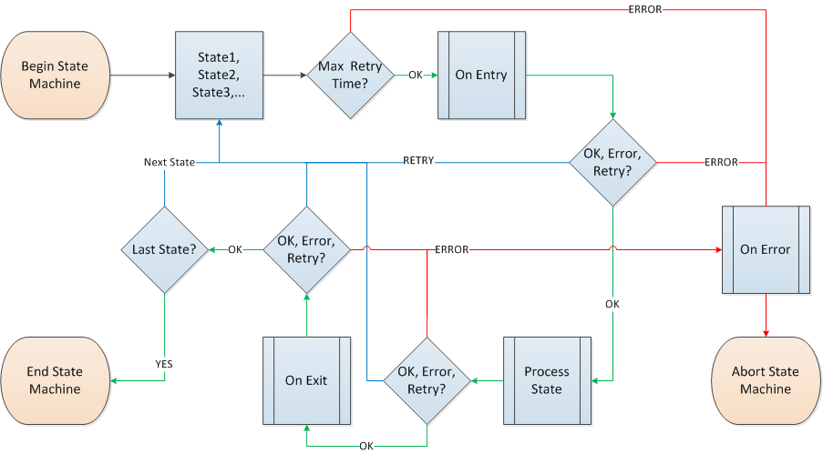
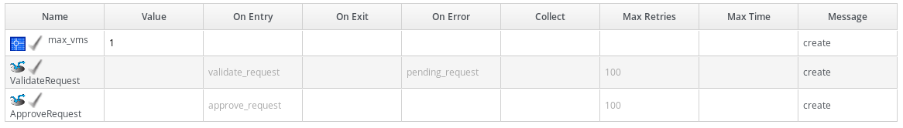
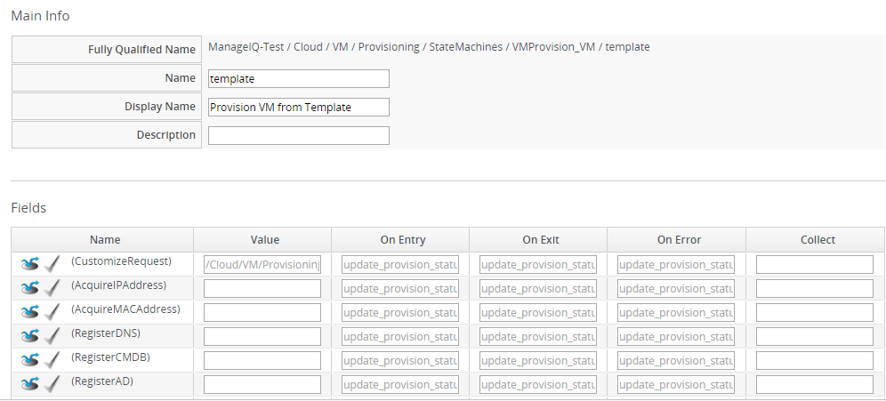
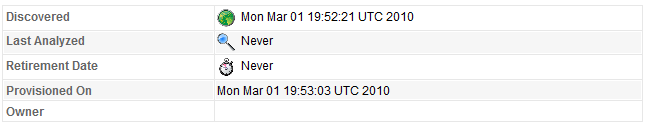

## Fulfilling Requests

### Fulfilling a Request

After a request has been approved, {{ site.data.product.title }} then goes through the
steps required to complete the request. The steps followed for a regular
provision from a virtual machine to a virtual machine (not to a
template) are found by navigating to menu:Automate\[Explorer\], then
listed under menu:DOMAIN\[Cloud|Infrastructure \> VM \> Provisioning \>
VMProvision\_VM \> Provision VM from Template (template)\]. The value
for each state shows where the instance resides in the **Datastore**
accordion. The default set of execution steps is shown below. For more
information on state machines, see [State Machines](#state-machines).

### Default Execution Steps in States Instance

| Step                | Description                                                                         |
| ------------------- | ----------------------------------------------------------------------------------- |
| Customize Request   | Apply customizations.                                                               |
| Acquire IP Address  | Integrates with IPAM (IP Address Management) to get an IP Address.                  |
| Acquire MAC Address | Integrates with IPAM to get a MAC Address.                                          |
| Register DNS        | Integrates with IPAM to register with DNS.                                          |
| Register CMDB       | Integrates with CMDB (Configuration Management Database) to register with the CMDB. |
| Register AD         | Integrates with IPAM to register with active directory.                             |
| PreProvision        | Pre-provisioning steps.                                                             |
| Provision           | Create the virtual machine or instance.                                             |
| CheckProvisioned    | Check that the new virtual machine or instance is in the VMDB.                      |
| PostProvision       | Post-provisioning steps.                                                            |
| Register DHCP       | Integrate with IPAM to register the IP address with DHCP Server.                    |
| Activate CMDB       | Integrate with IPAM to activate the virtual machine or instance in the CMDB.        |
| Email owner         | Send email to owner that the virtual machine or instance has been provisioned.      |

#### Quotas

Quotas allow you to establish maximum usage thresholds for an user,
group, or tenant for provisioned virtual machines or instances and are
integrated into provisioning profiles. These maximums are checked after
the approval but before the actual provision request is started. The
quota is set for the tenant or group as a whole.

##### Applying User or Group Quotas

1.  Log in as a user with administrator or super administrator rights to
    the {{ site.data.product.title }} console.

2.  Navigate to menu:Automate\[Explorer\].

3.  Copy the menu:ManageIQ\[System \> CommonMethods \> QuotaStateMachine
    \> quota\] instance to a custom DOMAIN.

4.  From the accordion menu, click menu:DOMAIN\[System \> CommonMethods
    \> QuotaStateMachine \> quota\].

    

    By default, quotas are applied to tenants and do not require any
    change in menu:Automate\[Explorer\].

    

5.  Click (**Configuration**),
    (**Edit this instance**).
    

    1.  Set the value for **Quota Source Type** to *user* or *group*.

        

        A user creating a provisioning request must have an email
        address saved in their profile, or provisioning may fail. See
        [Creating a
        User](https://www.manageiq.org/docs/reference/latest/general_configuration/index.html#creating-a-user)
        in *General Configuration* for details on configuring users.

        

    2.  Set the values for **VM Warning Count**, **VM Maximum Count**,
        **Storage Warning Limit**, **Storage Maximum Limit**, **CPU
        Warning Count**, **CPU Maximum Count**, **Memory Warning
        Limit**, or **Memory Maximum Limit** to be the maximums for a
        specific user or group.

6.  Click **Save**.

##### Using Tags for Owner and Group Quotas

{{ site.data.product.title }} provides tags for enforcing quotas for the owners of
virtual machines or instances. Ownership of a virtual machine or
instance can be set either during the provisioning process or by using
the **Configuration Set Ownership** button. If a virtual machine or
instance has an owner, the value is displayed in the **Lifecycle**
section of the virtual machine or instance summary page.

Quota tags can be assigned directly to **either** a group or owner
**not** to a configuration item. The table below shows the tags for use
in quotas.

| Category Display Name (Name)            | Use                                                                                                                                                                          |
| --------------------------------------- | ---------------------------------------------------------------------------------------------------------------------------------------------------------------------------- |
| Quota Max CPU (quota\_max\_cpu)         | Sets the maximum number of CPUs summed over all virtual machines and instances owned by the group or user. Sample Values: 1, 2, 3, 4, 5, 10, 20, 30, 40, 50                  |
| Quota Max Memory (quota\_max\_memory)   | Sets the maximum memory summed over all virtual machines and instances owned by the group or user. Sample Values: 1024, 2048, 4096, 8192, 10240, 20480, 40960, 81920 (in MB) |
| Quota Max Storage (quota\_max\_storage) | Sets the maximum storage summed over virtual machines and instances owned by the group or user. Sample Values: 10, 100, 1000, 20, 200, 40, 400 (in GB)                       |

##### Applying a Tag to a User or User Group

1.  Click  (**Configuration**).

2.  Click the **Access Control** accordion, and select the user or group
    that you want to tag.

3.  Click (**Policy**), then click
    (**Edit Tags**).

4.  Select the appropriate customer tag to assign, then the value.

5.  Click **Save**.

When quotas are applied by both automate instance and tagging, the
tagged values will have higher precedence.

##### State Machines

The automate state machine processes an ordered list of states. It can
ensure the successful completion of a step before the next step is run,
permit steps to be retried, allow setting a maximum time to retry the
state before exiting, and number of retries before exiting the state.
Before each state is executed, the `On_Entry` method is executed and
after the state ends the `On_Exit` or `On_Error` method is executed
based on how the state ends.

The following components make up a {{ site.data.product.title }} automate state
machine:

| Component     | Description                                                                                                                                                                                                     |
| ------------- | --------------------------------------------------------------------------------------------------------------------------------------------------------------------------------------------------------------- |
| On\_Entry     | Method to run when entering the state. It enables you to execute an automate method to do some pre-processing before the state of the state machine is processed.                                               |
| On\_Exit      | Method to run when exiting the state.                                                                                                                                                                           |
| On\_Error     | Method to run if an error is encountered when running the state. It enables you to execute an automate method to do some final processing before the state machine finally exits (MIQ\_ABORT) due to the error. |
| Default Value | Runs after the On\_Entry method completes (The actual state being processed).                                                                                                                                   |
| Max Retries   | Maximum number of times to retry the state before exiting.                                                                                                                                                      |
| Max Time      | Maximum time in seconds to retry the state before exiting.                                                                                                                                                      |

In the diagram below, you can see how these components combine to create
a state machine workflow.

The retry logic, `On_Entry` and `On_Error` are distinct cases in the
program flow.

**Code snippet demonstrating the state machine retry logic:**

    # Get current provisioning status
    task = $evm.root['service_template_provision_task']
    task_status = task['status']
    result = task.status

    Then check the result to see how it should proceed:

    case result
    when 'error'
      $evm.root['ae_result'] = 'error'
    .....
    when 'retry'
      $evm.root['ae_result'] = 'retry'
      $evm.root['ae_retry_interval'] = '1.minute'
    when 'ok'
      $evm.root['ae_result'] = 'ok'
    end

    When the result is "retry", it sets:
      $evm.root['ae_result'] = 'retry'
      $evm.root['ae_retry_interval'] = '1.minute'

The following image shows a simple state machine pertaining to approving
a provision request. This instance can be found in
menu:Datastore\[ManageIQ \> Infrastructure \> VM \> Provisioning \>
StateMachines \> ProvisioningRequestApproval \> Default\].

1.  The attribute **max\_vms** has a value of 1. State machine
    processing can use the attributes of the state machine instance to
    make logic decisions. In this case, the **validate\_request**
    method, which is processed during the **On\_Entry** portion of the
    **ValidateRequest** state, evaluates the **max\_vms** attribute. If
    the number of virtual machines requested is less than the
    **max\_vms** value, the request can be auto-approved.

2.  **ValidateRequest** is the first state to be executed.

3.  **ApproveRequest** is the next state to be executed.

Grayed out items reflect values that are set in the class schema. These
values can be overwritten on a per instance basis.

##### Customizing Provisioning States

The steps followed when provisioning a virtual machine or cloud instance
are completed based on instances from the
menu:DOMAIN\[Cloud|Infrastructure \> VM \> Provisioning \> StateMachines
\> VMProvision\_VM\] class. Depending on your environment you can
remove, change, or add steps to the provisioning process. For example,
if you are not integrating with IPAM or a CMDB, then you can remove
those execution steps. 

##### Editing the Default State Instance

1.  Navigate to menu:Automate\[Explorer\].

2.  From the accordion menu, click menu:DOMAIN\[Cloud \> VM \>
    Provisioning \> StateMachines \> VMProvision\_VM\].

    

    **DOMAIN** must be a user-defined Domain and not the locked ManageIQ
    Domain. If necessary, you can copy the class from the ManageIQ
    domain into a custom domain.

    This example uses the **Cloud** Namespace, but can also use the
    **Infrastructure** namespace.

    

3.  Click (**Configuration**), then
    (**Edit this instance**).
    

4.  For each step that you want to remove, clear the entries in the
    **Value**, **On Entry**, **On Exit**, and **On Error** columns.

5.  Click **Save**.

##### Viewing the Status of a Provisioning Request

After a request has been approved, the various stages of fulfillment are
executed. You can see the progress of the provisioning process by
viewing its status.

1.  Navigate to menu:Services\[Requests\]. The list of requests is
    shown.

2.  Click on a specific request for more information. Once the
    provisioning begins, if the request was supposed to create more than
    one virtual machine or instance, a field will appear called
    **Provisioned VMs**. Click on the number that appears next to it for
    information on each of the individual provisions.

##### Viewing a Provisioned Virtual Machine or Instance

When a virtual machine or instance is created as a result of a
provisioning request, its summary screen will show when it was
provisioned in the **Lifecycle** area of the respective summary.

1.  From menu:Services\[Workloads\], click the virtual machine or
    instance that you want to view. 

##### Viewing a Virtual Machine or Instance Summary

From menu:Services\[Workloads\], click the virtual machine or instance
that you want to view.
