## Provisioning Requests

The following options are available when making provisioning requests:

  - Set an owner (User can do this using LDAP lookup)

  - Assign a purpose (tag)

  - Select a template or image from which to create a new virtual
    machine or instance respectively

  - Choose placement

  - Set hardware requirements

  - Specify the vLan

  - Customize the guest operating system

  - Schedule the provisioning 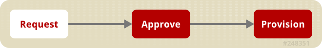

### Requirements for Provisioning Virtual Machines and Instances

{{ site.data.product.title }} supports the provisioning of VMware ESX hypervisors. To
provision a virtual machine from VMware providers, you must have an
appliance with the Automation Engine role enabled.

If you are using a Windows template, the following configuration is
required:

  - To customize settings that are inside the operating system, Sysprep
    must be copied to the appropriate directory on your vCenter
    computer. Usually this location is: `C:\Documents and Settings\All
    Users\Application Data\VMware\VMware VirtualCenter\sysprep`. Copy
    the Sysprep tools to the relevant operating system subdirectory. If
    you are running a standard Win2008 operating system, this step is
    unnecessary as Sysprep is included as standard.

  - The Windows template must have the latest version of VMware tools
    for its ESX Server. Check the VMware Site for more information. If
    you are creating a new password for the Administrator account, the
    Administrators password must be blank on the template. This is a
    limitation of Microsoft Sysprep.

See the VMware documentation for a complete list of customization
requirements.

### Requirements for Provisioning Virtual Machines from Red Hat Virtualization Manager

<table>
<colgroup>
<col style="width: 50%" />
<col style="width: 50%" />
</colgroup>
<thead>
<tr class="header">
<th>Item</th>
<th>Requirements</th>
</tr>
</thead>
<tbody>
<tr class="odd">
<td>
Red Hat Virtualization Manager version 4.0 or higher
</td>
<td>
Red Hat Virtualization Manager properly installed with API in default location <a href="https://server:8443/api">https://server:8443/api</a>
</td>
</tr>
<tr class="even">
<td>
Red Hat Virtualization Manager History Database
</td>
<td>
Red Hat Virtualization Manager Data Warehouse (DWH) properly installed with access to the PostgreSQL database on the Red Hat Virtualization Manager server. Port 5432 open in iptables.

md5 authentication allowed to {{ site.data.product.title }} appliances in <code>pg_hba.conf</code>.

PostgreSQL set to listen for connections on <code>*:5432</code> in <code>postgresql.conf</code>.

Credentials provided during database setup to be used in {{ site.data.product.title }} UI.
</td>
</tr>
<tr class="odd">
<td>
Storage Supported for {{ site.data.product.title }} Virtual Machine Analysis
</td>
<td>
NFS - {{ site.data.product.title }} server must be able to mount NFS storage domain.

iSCSI / FCP - Cluster must use full Red Hat Enterprise Linux (not Red Hat Virtualization Hypervisor) Hosts.

DirectLUN Hook installed on each host and registered to Red Hat Virtualization Managers.

Must have {{ site.data.product.title }} appliance in each Cluster with this storage type.

{{ site.data.product.title }} appliance virtual machine container must have DirectLUN attribute set.

Local storage - Not yet supported (Red Hat does not recommend due to single point of failure).
</td>
</tr>
</tbody>
</table>

### PXE Provisioning

PXE is a boot method that allows you to load files from across a network
link. {{ site.data.product.title }} uses it for files required for provisioning
virtual machines. PXE can be used for provisioning for either Red Hat
Virtualization Manager or VMware.

**Procedure Overview**

1.  Connect to the **PXE Server**.

2.  Create a **System Image Type**.

3.  Associate each **PXE** image with an image type.

4.  Create a customization template.

**Requirements for PXE Provisioning**

  - DHCP server configured with required PXE implementation

  - PXE implementation for Linux virtual machine provisioning

  - NFS or SAMBA read and write access to create and modify files on the
    PXE server

  - {{ site.data.product.title }} Server uses NFS mount to read and write the response
    files

  - HTTP read access to the NFS share location as virtual machines use
    this URL to access PXE images and Kickstart or Cloud-Init
    configuration files

  - Operating system installation media available to be streamed from
    PXE server

  - Images configured for desired operating systems

  - Kickstart or Cloud-Init templates to configure operating systems
    with desired packages

**Additional Requirements for Provisioning Linux Virtual Machines**

  - Linux distribution kernel and ramdisk available over HTTP

  - Linux sources available over HTTP

  - Sample PXE menu item that boots this kernel

**Additional Requirements for Provisioning Windows Virtual Machines**

  - WinPE ISO built with rhev-agent-tools (for RHEV-M environments) and
    configured to mount shares for Windows source files and Sysprep
    files and configured to run customization script

  - Windows based WIM file with operating system installed and
    configured with Sysprep

  - Sample Sysprep unattend file to be used with the operating system

  - Sample PXE menu item that downloads WinPE ISO, mount in memdisk and
    boot into WinPE environment

#### Connecting to a PXE Server

The following procedure connects to a PXE server and adds its details to
{{ site.data.product.title }}.

1.  Navigate to menu:Compute\[Infrastructure \> PXE\].

2.  Click (**Configuration**), then
    (**Add a New PXE Server**).

3.  In **Basic Information**, type a **Name** that will be meaningful in
    your environment. 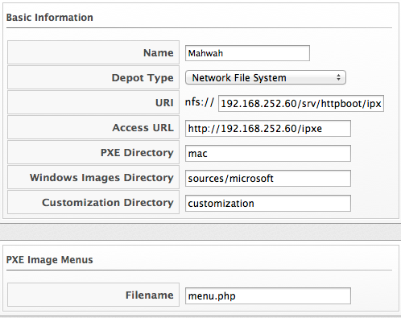

4.  For **Depot Type**, select either **Network File System** (NFS) or
    **Samba**. The fields to enter in the dialog depend on the **Depot
    Type**.

      - For NFS, type in the **URI**, **Access URL**, **PXE Directory**,
        **Windows Images Directory**, and **Customization Directory**.
        When you provision, {{ site.data.product.title }} writes a text file to the
        **PXE Directory**. The file is named after the MAC address of
        the NIC that is assigned to the virtual machine. It contains
        where to get the kernel and initrd image. This file is removed
        after a successful provision. The **Windows Images Directory**
        is where the files are located on your NFS for the provisioning
        of Windows operating systems. The **Customization Directory** is
        where your Kickstart and Sysprep files are located.

      - If using a **Depot Type** of **Samba**, you will not need
        **Access URL**, but you will need a **User ID**, and
        **Password**, in addition to the items required for NFS.

5.  For **PXE Image Menus**, type the **Filename** for the PXE Boot
    menu.

6.  Click **Add**.

7.  Select the new PXE server from the tree on the left, and click
    (**Configuration**), then
    (**Refresh**) to see your existing images.

Next, create PXE Image types to associate with the customization
templates and to specify if the image type is for a virtual machine, a
host, or both.

#### Creating System Image Types for PXE

The following procedure creates a system image type for PXE servers.

1.  Navigate to menu:Compute\[Infrastructure \> PXE\].

2.  Click the **System Image Types** accordion.
    

3.  Click (**Configuration**), then
    (**Add a new System Image Type**).

4.  In **Basic Information**, type in a **Name** and select a **Type**.
    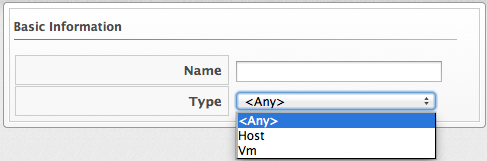

      - Use **Vm** if you want this image type to only apply to virtual
        machines.

5.  Click **Add**.

After creating the System Image Types, assign the types to each image on
your PXE servers. To do this, you will select each image on the PXE
server and identify its type.

#### Setting the PXE Image Type for a PXE Image

The following procedure sets the image type for a chosen PXE image.

1.  Navigate to menu:Compute\[Infrastructure \> PXE\].

2.  Click the **PXE Servers** accordion and select the image that you
    want to set a type for.

3.  Click (**Configuration**), then
    (**Edit this PXE Image**).

4.  From the **Basic Information** area, select the correct type. If
    this PXE image will be used as the **Windows Boot Environment**,
    check **Windows Boot Environment**. At the time of this writing,
    only one PXE Image can be identified as the **Windows Boot
    Environment**. Therefore, checking one as the **Windows Boot
    Environment**, will remove that from any other PXE image with that
    check. 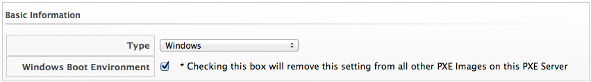 Click **Save**.
    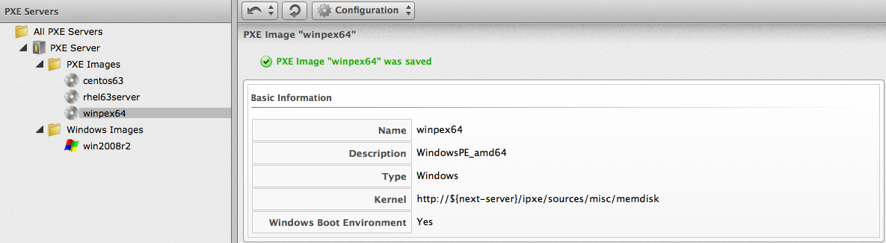

### ISO Provisioning

{{ site.data.product.title }} also allows ISO provisioning from Red Hat Virtualization
Manager datastores. To use this feature, you will need to do the
following before creating a provision request.

1.  Add the **ISO Datastore**. The Red Hat Virtualization Manager system
    must have already been discovered or added into the VMDB. For more
    information, see [Adding a Red Hat Enterprise Virtualization Manager
    Provider](https://access.redhat.com/documentation/en-us/red_hat_cloudforms/4.7/html-single/managing_providers/#adding_a_red_hat_enterprise_virtualization_manager_provider)
    in *Managing Providers*.

2.  Refresh the **ISO Datastore**.

3.  Create a **System Image Type**.

4.  Set the **ISO Image Type**.

5.  **Create** a customization template.

#### Adding an ISO Datastore

The following procedure adds an ISO Datastore from your Red Hat
Virtualization environment.

1.  Navigate to menu:Compute\[Infrastructure \> PXE\].

2.  Click the **ISO Datastores** accordion.

3.  Click (**Configuration**),
    (**Add a new ISO Datastore**).

4.  Select the Cloud or Infrastructure provider hosting the ISO
    Datastore.

5.  Click **Add**.

The ISO datastore is added to {{ site.data.product.title }}.

#### Refreshing an ISO Datastore

The following procedure refreshes the chosen ISO datastore and updates
{{ site.data.product.title }} with available ISOs.

1.  Navigate to menu:Compute\[Infrastructure \> PXE\].

2.  Click the **ISO Datastores** accordion, and select an ISO datastore.

3.  Click (**Configuration**), then click
    (**Refresh Relationships**).

#### Creating System Image Types for ISO

The following procedure creates a system image type for ISO Servers.

1.  Navigate to menu:Compute\[Infrastructure \> PXE\].

2.  Click the **System Image Types** accordion.

3.  Click (**Configuration**), then
    (**Add a new System Image Type**).

4.  In **Basic Information**, type in a **Name** and select a **Type**.
    

      - Use **Vm** if you want this image type to only apply to virtual
        machines.

5.  Click **Add**. 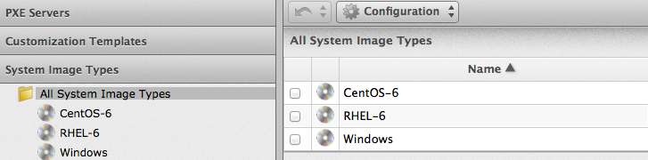

After creating the system image types, assign the types to each image on
your ISO servers. To do this, you will select each image on the ISO
server and identify its type.

#### Setting the Image Type for an ISO Image

The following procedure sets the image type for an ISO image.

1.  Navigate to menu:Compute\[Infrastructure \> PXE\].

2.  Click the **ISO Datastores** accordion, and select the image that
    you want to set a type for.

3.  Click (**Configuration**), then
    (**Edit this ISO Image**).

4.  From the **Basic Information** area, select the correct **Type**.
    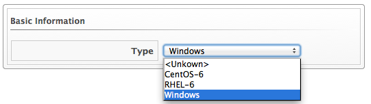

5.  Click **Save**.

### Customization Templates for Virtual Machine and Instance Provisioning

Add a customization template to provide **Kickstart**, **Cloud-Init**,
or **Sysprep** files for the initial loading of the operating system.

  - When creating a template using Red Hat Virtualization, install the
    **cloud-init** package on the source virtual machine. This enables
    Cloud-Init to source configuration scripts when a virtual machine
    built on that template boots.

  - See [Using Cloud-Init to Automate the Configuration of Virtual
    Machines](https://access.redhat.com/documentation/en-US/Red_Hat_Enterprise_Virtualization/3.6/html-single/Virtual_Machine_Management_Guide/index.html#sect-Using_Cloud-Init_to_Automate_the_Configuration_of_Virtual_Machines)
    in the Red Hat Virtualization *Administration Guide* for more
    information on using Cloud-Init in a Red Hat Virtualization
    environment.

  - See the [Cloud-Init
    Documentation](http://cloudinit.readthedocs.org/en/latest/) web site
    for example scripts.

<!-- end list -->

  - The **Kickstart** file must be named **ks.cfg**.

  - Set the new virtual machine to power down after provisioning is
    complete.

  - {{ site.data.product.title_short }} must use the virtual machine payload feature
    of Red Hat Virtualization to create a floppy disk containing the
    data from the selected customization template.

  - Customize the installer to include the data written to the floppy
    disk payload.

<!-- end list -->

  - RHEL 7.5 and above

  - `isolinux.cfg` NDASH add **ks=cdrom** to the **append** line

  - `ks.cfg` NDASH which must minimally include:

<!-- end list -->

    ### Pre Install Scripts
    %pre

    # Mount the floppy drive
    modprobe floppy
    mkdir /tmp/floppy
    mount /dev/fd0 /tmp/floppy
    %end

    # Include ks.cfg file from the floppy (written by CFME based on selected customization template)
    %include /tmp/floppy/ks.cfg

### Customization Script Additions for Virtual Machine and Instance Provisioning

| Customization Type | Reason to Include                                                                                                                                                                                                         | Script entries                                                                                                                                                                                                                                                                                                                                                                                                                                                                                                                                                                     |
| ------------------ | ------------------------------------------------------------------------------------------------------------------------------------------------------------------------------------------------------------------------- | ---------------------------------------------------------------------------------------------------------------------------------------------------------------------------------------------------------------------------------------------------------------------------------------------------------------------------------------------------------------------------------------------------------------------------------------------------------------------------------------------------------------------------------------------------------------------------------- |
| Kickstart          | Takes the values from the **Customize** tab in **Provisioning Dialog** and substitutes them into the script.                                                                                                              | *Configure Networking based on values from provisioning dialog \<% if evm\[:addr\_mode\].first == 'static' %\> \<% network\_string = "network --onboot yes --device=eth0 --bootproto=static --noipv6" %\> \<% \["ip", :ip\_addr, "netmask", :subnet\_mask, "gateway", :gateway, "hostname", :hostname, "nameserver", :dns\_servers\].each\_slice(2) do |ks\_key, evm\_key| %\> \<% network\_string \<\< " --*{ks\_key} \#{evm\[evm\_key\]}" unless evm\[evm\_key\].blank? %\> \<% end %\> \<%= network\_string %\> \<% else %\> network --device=eth0 --bootproto=dhcp \<% end %\> |
| Kickstart          | Encrypts the root password from the **Customize** tab in the **Provisioning Dialog**.                                                                                                                                     | rootpw --iscrypted \<%= ManageIQ::Password.md5crypt(evm\[:root\_password\]) %\>                                                                                                                                                                                                                                                                                                                                                                                                                                                                                                    |
| Kickstart          | Sends status of the provision back to {{ site.data.product.title }} Server for display in the {{ site.data.product.title }} Console.                                                                                                                  |                                                                                                                                                                                                                                                                                                                                                                                                                                                                                                                                                                                    |
| Sysprep            | Encrypts the root password from the **Customize** tab in the **Provisioning Dialog**. The value for the **AdministratorPassword** line must be inserted to use the password from the **Provision Dialog** and encrypt it. | \<UserAccounts\> \<AdministratorPassword\> \<Value\>\<%= ManageIQ::Password.sysprep\_crypt(evm\[:root\_password\]) %\>\</Value\> \<PlainText\>false\</PlainText\> \</AdministratorPassword\> \</UserAccounts\>                                                                                                                                                                                                                                                                                                                                                                     |

### Adding a Customization Template

1.  Navigate to menu:Compute\[Infrastructure \> PXE\].

2.  Click the **Customization Templates** accordion.

3.  Click (**Configuration**),
    (**Add a new Customization Template**).

4.  In **Basic Information**, type in a **Name** and **Description**.
    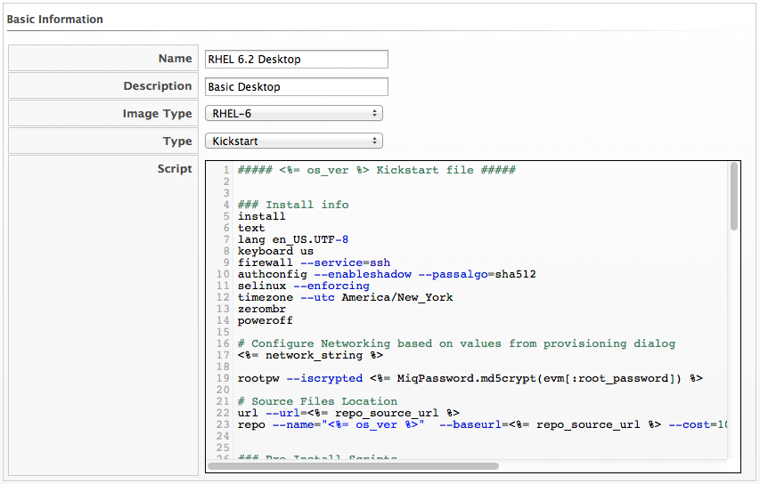

5.  Select the **Image Type**. This list should include the PXE image
    types you created.

6.  In **Type**, select **Kickstart** or **CloudInit** for Linux based
    systems, and **Sysprep** for Windows based system.

7.  In the **Script** area, either paste the script from another source
    or type the script directly into the {{ site.data.product.title }} interface.

8.  Click **Add**.

The default dialogs show all possible parameters for provisioning. To
limit the options shown, see [Customizing Provisioning
Dialogs](#provisioning-dialogs-customizing).

### Provisioning Virtual Machines

There are four types of provisioning requests available in
{{ site.data.product.title }}:

1.  Provision a new virtual machine from a template

2.  Clone a virtual machine

3.  Publish a virtual machine to a template

4.  Provision a virtual machine using cloud-init via REST API.

#### Provisioning a Virtual Machine from a Template

You can provision virtual machines through various methods. One method
is to provision a virtual machine directly from a template stored on a
provider.

  - To provision a virtual machine, you must have the "Automation
    Engine" role enabled.

  - During virtual machine provisioning, the **Customize** tab is hidden
    if the template has an unknown operating system (OS) type. To make
    the **Customize** tab visible in the user interface, you will need
    to set the OS type from the provider or perform SmartState analysis
    on the template to detect the OS type.

To provision a virtual machine from a template:

1.  Navigate to menu:Compute\[Infrastructure \> Virtual Machines\].

2.  Click (**Lifecycle**), and then
    (**Provision VMs**).

3.  Select a template from the list.

4.  Click **Continue**.

5.  On the **Request** tab, enter the request information.

    

    In **Request Information**, enter your name and email address. The
    requester will receive status emails about the provisioning request
    such as auto-approval, quota, provision complete, retirement,
    request pending approval, and request denied.

    

    Parameters with a \* next to the label are required to submit the
    provisioning request. To change the required parameters, see
    [Customizing Provisioning
    Dialogs](#provisioning-dialogs-customizing).

    

6.  Click the **Purpose** tab to select the appropriate tags for the
    provisioned virtual machines.

7.  Click the **Catalog** tab to select the template to provision from.
    This tab is context sensitive based on provider.

8.  For templates on VMware providers: 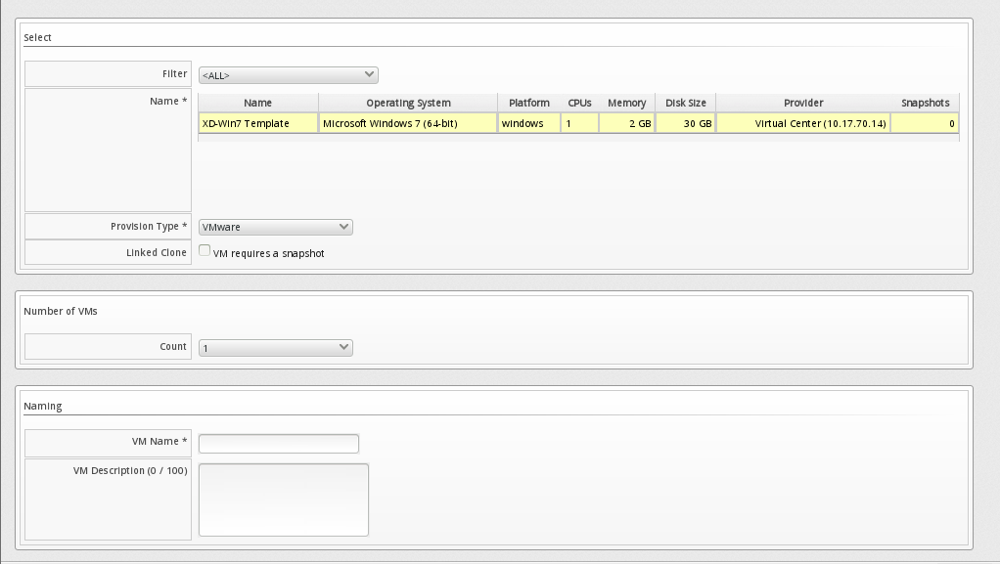

    1.  For **Provision Type**, select **VMware** or **PXE**.

        1.  If **VMware** is selected, select **Linked Clone** to create
            a linked clone to the virtual machine instead of a full
            clone. Since a snapshot is required to create a linked
            clone, this box is only enabled if a snapshot is present.
            Select the snapshot you want to use for the linked clone.

        2.  If **PXE** is selected, select a PXE **Server** and
            **Image** to use for provisioning.

    2.  Under **Count**, select the number of virtual machines to create
        in this request.

    3.  Use **Naming** to specify a virtual machine name and virtual
        machine description. When provisioning multiple virtual
        machines, a number will be appended to the virtual machine name.

9.  For templates on Red Hat providers:

    1.  Select the **Name** of a template to use.

    2.  For **Provision Type**, select either **ISO**, **PXE**, or
        **Native Clone**. You must select **Native Clone** in order to
        use a Cloud-Init template.

        1.  If **Native Clone** is selected, select **Linked Clone** to
            create a linked clone to the virtual machine instead of a
            full clone. This is equivalent to *Thin Template
            Provisioning* in Red Hat Virtualization. Since a snapshot is
            required to create a linked clone, this box is only enabled
            if a snapshot is present. Select the snapshot to use for the
            linked clone.

        2.  If **ISO** is selected, select an ISO **Image** to use for
            provisioning.

        3.  If **PXE** is selected, select a PXE **Server** and
            **Image** to use for provisioning.

    3.  Under **Count**, select the number of virtual machines you want
        to create in this request.

    4.  Use **Naming** to specify a **VM Name** and **VM Description**.
        When provisioning multiple virtual machines, a number will be
        appended to the **VM Name**.

10. Click the **Environment** tab to decide where you want the new
    virtual machines to reside.

    1.  If provisioning from a template on VMware, you can either let
        {{ site.data.product.title }} decide for you by checking **Choose
        Automatically**, or select a specific cluster, resource pool,
        folder, host, and datastore. VMware virtual machines can also be
        provisioned to a clustered datastore by selecting it under
        **Datastore**. Additionally, you can assign a storage profile to
        a VMware virtual machine under **Datastore** to configure the
        virtual machine to operate using a storage profile from that
        datastore.

        Note, read-only datastores are excluded when provisioning a
        virtual machine.

    2.  If provisioning from a template on Red Hat, you can either let
        {{ site.data.product.title }} decide for you by checking **Choose
        Automatically**, or select a datacenter, cluster, host and
        datastore.

11. Click the **Hardware** tab to set hardware options. 

    1.  In **Hardware**, set the number of sockets, cores per socket,
        memory in MB, and disk format: thin, pre-allocated/thick or same
        as the provisioning template (default).

    2.  For VMware provisioning, set the **VM Limits** of CPU and memory
        the virtual machine can use.

    3.  For VMware provisioning, set the **VM Reservation** amount of
        CPU and memory.

12. Click **Network** to set the vLan adapter. Additional networking
    settings that are internal to the operating system appear on the
    **Customize** tab. 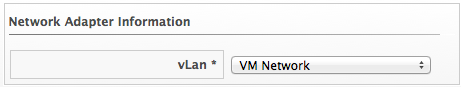

    1.  In **Network Adapter Information**, select the **vLan**.

        

        A VMware virtual machine can be provisioned to a DVPortgroup by
        selecting it from the **vLan** list. Prior to provisioning a
        virtual machine, the DVPortgroup must be created on a vSphere
        Distributed Switch (VDS) in VMware vCenter in order for
        {{ site.data.product.title }} to list the DVPortgroup under **vLan**.

        

13. Click **Customize** to customize the operating system of the new
    virtual machine. These options vary based on the operating system of
    the template. 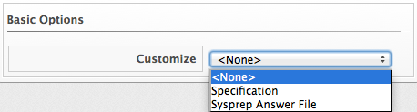

14. For Windows provisioning:

    1.  To use a custom specification from the provider, click
        **Specification**. To select an appropriate template, choose
        from the list in the custom specification area. The values that
        are honored by {{ site.data.product.title }} display.

        

        Any values in the specification that do not show in the
        {{ site.data.product.title }} console’s request dialogs are not used by
        {{ site.data.product.title }}. For example, for Windows operating systems, if
        you have any run once values in the specification, they are not
        used in creating the new virtual machines. Currently, for a
        Windows operating system, {{ site.data.product.title }} honors the unattended
        GUI, identification, workgroup information, user data, windows
        options, and server license. If more than one network card is
        specified, only the first is used.

        

        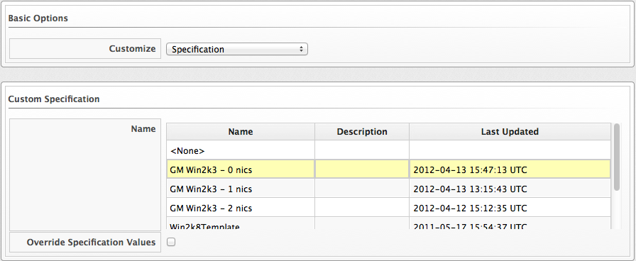

        To modify the specification, select **Override Specification
        Values**.

    2.  Select **Sysprep Answer File**, to upload a Sysprep file or use
        one that exists for a custom specification on the Provider where
        the template resides. To upload a file, click **Browse** to find
        the file, and then upload. To use an answer file in
        **Customization Specification**, click on the item. The answer
        file will automatically upload for viewing. You cannot make
        modifications to it.

15. For Linux provisioning:

    1.  Under **Credentials**, enter a **Root Password** for the
        **root** user to access the instance.

    2.  Enter a **IP Address Information** for the instance. Leave as
        **DHCP** for automatic IP assignment from the provider.

    3.  Enter any **DNS** information for the instance if necessary.

    4.  Select **Customize Template** for additional instance
        configuration. Select from the Kickstart or Cloud-Init
        customization templates stored on your appliance.

16. Click the **Schedule** tab to select when provisioning begins.

    1.  In **Schedule Info**, select when to start provisioning. If you
        select **Schedule**, you will be prompted to enter a date and
        time. Select **Stateless** if you do not want the files deleted
        after the provision completes. A stateless provision does not
        write to the disk so it requires the PXE files on the next boot.

    2.  In **Lifespan**, select to power on the virtual machines after
        they are created, and to set a retirement date. If you select a
        retirement period, you will be prompted for when you want a
        retirement warning. 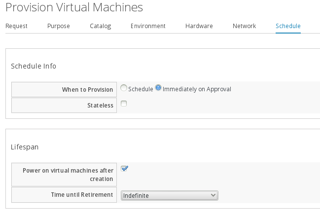

17. Click **Submit**.

The provisioning request is sent for approval. For the provisioning to
begin, a user with the administrator, approver, or super administrator
account role must approve the request. The administrator and super
administrator roles can also edit, delete, and deny the requests. You
will be able to see all provisioning requests where you are either the
requester or the approver.

After submission, the appliance assigns each provision request a
**Request ID**. If an error occurs during the approval or provisioning
process, use this ID to locate the request in the appliance logs. The
Request ID consists of the region associated with the request followed
by the request number. As regions define a range of one trillion
database IDs, this number can be several digits long.

**Request ID Format**

Request 99 in region 123 results in Request ID 123000000000099.

#### Provisioning a Virtual Machine using Cloud-Init via REST API

Cloud-init is a tool for automating the initial setup of virtual
machines. In {{ site.data.product.title_short }}, you can use cloud-init via REST API
to provision a virtual machine that was created based on a template.

To use cloud-init, the template from which the virtual machine is
provisioned must have cloud-init package installed, and have the **Use
Cloud-Init/Sysprep** option selected.

For a virtual machine provision request via REST API, ensure the
following two fields in the request’s body are set correctly, otherwise
cloud-init may not work.

  - VLAN

  - sysprep\_enabled

**VLAN.**

The value of **VLAN** in the API request can be one of the following
options:

| VLAN value                    | Note                                                                                                                       | vNIC profile                                                                    |
| ----------------------------- | -------------------------------------------------------------------------------------------------------------------------- | ------------------------------------------------------------------------------- |
| \<empty\>                     | Must be written within the \<..\>                                                                                          | No vNIC profile                                                                 |
| \<Template\>                  | Must be written within the \<..\>                                                                                          | Use the template’s default vNIC profile                                         |
| profile\_name (network\_name) | Must include a space between profile\_name (network\_name), otherwise it will fail. For example, **ovirtmgmt (ovirtmgmt)** | Set the specified vNIC profile.                                                 |
| vNIC profile ID               |                                                                                                                            | Set the specified vNIC profile, such as `3a8dce01-dd59-4a46-8a6f-823acccda79f`. |

**sysprep\_enabled.**

The value of sysprep\_enabled in the API request must be in the
following format.

Sysprep\_enabled is written in the order: \[value\] - \[it’s meaning\] -
\[how it appears in the {{ site.data.product.title_short }} user interface virtual
machine provision dialog’s **Customize** tab\]

**For Windows template**:

  - **"fields"** - Sysprep Specification
    In the {{ site.data.product.title_short }} user interface, when you navigate to
    the virtual machine provision dialog (menu:Compute\[Infrastructure
    \> Virtual Machine\]), this option located under the **Customize**
    tab’s **Customize** drop-down list is called **Sysprep
    Specification**.

  - **"file"** - Sysprep answer file
    In the {{ site.data.product.title_short }} user interface, when you navigate to
    the virtual machine provision dialog (menu:Compute\[Infrastructure
    \> Virtual Machine\]), this option located under the **Customize**
    tab’s **Customize** drop-down list is called **Sysprep answer
    file**.

**For Linux template**:

  - **“fields”** - Customized template and any Customized parameters
    will be used
    In the {{ site.data.product.title_short }} user interface, when you navigate to
    the virtual machine provision dialog (menu:Compute\[Infrastructure
    \> Virtual Machine\]), this option located under the **Customize**
    tab’s **Customize** drop-down list is called **Specification**.

For cloud-init to work *(that is, to have the provisioned virtual
machine marked with **Use cloud-init** and the customized template as
well as customized parameters, if any, will be used)* "sysprep\_enabled"
must be set to “fields”. If you do not set it correctly, the customized
template will be ignored and the provisioned virtual machine will not be
marked with **Use cloud-init**; although, the template from which the
virtual machine is provisioned has it marked.

**For both Windows and Linux template**:

  - **“disabled”** - Do not customize
    In the {{ site.data.product.title_short }} user interface, when you navigate to
    the virtual machine provision dialog (menu:Compute\[Infrastructure
    \> Virtual Machine\]), this option located under the **Customize**
    tab’s **Customize** drop-down list is called **\<None\>**. The
    customized template will be ignored, and the provisioned virtual
    machine will not be marked with **Use cloud-init**, even though the
    template from which the virtual machine was provisioned, has it
    marked. The default value is 'disabled'.

For an example of virtual machine provisioning request using cloud-init
via REST API, see *Provisioning a Virtual Machine Using Cloud-init* in
the [{{ site.data.product.title }} REST
API](https://access.redhat.com/documentation/en-us/red_hat_cloudforms/4.7/html-single/red_hat_cloudforms_rest_api/index)
guide.

#### Cloning a Virtual Machine

Virtual machines can be cloned in other providers as well.

1.  Navigate to menu:Compute\[Infrastructure \> Virtual Machines\], and
    select the virtual machine you want to clone.

2.  Click (**Lifecycle**), and then
    (**Clone selected item**).

3.  Enter the requested information in the dialogs. Be sure to check the
    **Catalog** tab.

4.  Schedule the request on the **Schedule** tab.

5.  Click **Submit**.

#### Publishing a Virtual Machine to a Template (VMware Virtual Machines Only)

1.  Navigate to menu:Compute\[Infrastructure \> Virtual Machines\], and
    select the virtual machine you want to publish as a template.

2.  Click (**Lifecycle**), and then
    (**Publish selected VM to a Template**).

3.  Enter the requested information in the dialogs. Be sure to check the
    **Catalog** tab.

4.  Schedule the request on the **Schedule** tab.

5.  Click **Submit**.

#### Renaming a Provisioned Virtual Machine (VMware Virtual Machines Only)

{{ site.data.product.title }} allows you to rename a VMware virtual machine without
having to reprovision it.

To rename a VMware virtual machine:

1.  Navigate to menu:Compute\[Infrastructure \> Virtual Machines\], and
    select the VMware virtual machine you want to rename.

2.  Click (**Configuration**),
    (**Rename selected item**).

3.  In the **Basic Information** screen, provide a new **name**.

4.  Click **Save**.

The renamed virtual machine will appear in the inventory view.

### Provisioning Instances

Cloud instances follow the same process (Request, Approval, Deployment)
as a standard virtual machine from virtualization infrastructure. First,
a user makes a request for instances and specifies the image, volume or
volume snapshot, tags, availability zone and hardware profile flavor.
Second, the request goes through the approval phase. Finally,
{{ site.data.product.title }} executes the request.

#### Provisioning an EC2 Instance from an Image

1.  Navigate to menu:Compute\[Clouds \> Instances\].

2.  Click (**Lifecycle**), then click
    (**Provision Instances**).

3.  Select an image from the list presented.

4.  Click **Continue**.

5.  On the **Request** tab, enter information about this provisioning
    request. In **Request Information**, type in at least a first and
    last name and an email address. This email is used to send the
    requester status emails during the provisioning process for items
    such as auto-approval, quota, provision complete, retirement,
    request pending approval, and request denied. The other information
    is optional. If the {{ site.data.product.title }} Server is configured to use
    LDAP, you can use the **Look Up** button to populate the other
    fields based on the email address.

    

    Parameters with a \* next to the label are required to submit the
    provisioning request. To change the required parameters, see
    [Customizing Provisioning
    Dialogs](#provisioning-dialogs-customizing).

    

6.  Click the **Purpose** tab to select the appropriate tags for the
    provisioned instance.

7.  Click the **Catalog** tab for basic instance options.

    1.  To change the image to use as a basis for the instance, select
        it from the list of images.

    2.  Select the **Number of VMs** to provision.

    3.  Type a **VM Name** and **VM Description**.

8.  Click the **Environment** tab to select the instance’s
    **Availability Zone**, **Virtual Private Cloud**, **Cloud Subnet**,
    **Security Groups**, and **Elastic IP Address**. If no specific
    availability zone is required, select the **Choose Automatically**
    checkbox.

9.  Click the **Properties** tab to set provider options such as
    hardware flavor and security settings.

    1.  Select a flavor from the **Instance Type** list.

    2.  Select a **Guest Access Key Pair** for access to the instance.

    3.  Select the **CloudWatch** monitoring level. Leave as **Basic**
        for the default EC2 monitoring.

10. Click the **Customize** tab to set additional instance options.

    1.  Under **Credentials**, enter a **Root Password** for the
        **root** user access to the instance.

    2.  Enter a **IP Address Information** for the instance. Leave as
        **DHCP** for automatic IP assignment from the provider.

    3.  Enter any **DNS** information for the instance if necessary.

    4.  Select a **Customize Template** for additional instance
        configuration. Select from the Cloud-Init scripts stored on your
        appliance.

11. Click the **Schedule** tab to set the provisioning and retirement
    date and time.

    1.  In **Schedule Info**, choose whether the provisioning begins
        upon approval, or at a specific time. If you select
        **Schedule**, you will be prompted to enter a date and time.

    2.  In **Lifespan**, select whether to power on the instances after
        they are created, and whether to set a retirement date. If you
        select a retirement period, you will be prompted for when to
        receive a retirement warning.

12. Click **Submit**.

The provisioning request is sent for approval. For the provisioning to
begin, a user with the admin, approver, or super admin account role must
approve the request. The admin and super admin roles can also edit,
delete, and deny the requests. You will be able to see all provisioning
requests where you are either the requester or the approver.

After submission, the appliance assigns each provision request a
**Request ID**. If an error occurs during the approval or provisioning
process, use this ID to locate the request in the appliance logs. The
Request ID consists of the region associated with the request followed
by the request number. As regions define a range of one trillion
database IDs, this number can be several digits long.

**Request ID Format**

Request 99 in region 123 results in Request ID 123000000000099.

#### Provisioning an OpenStack Instance from an Image, Volume or Volume Snapshot



#### Provisioning an IBM Power Systems Virtual Servers Instance from an Image



#### Customizing Provisioning Dialogs



##### Adding a Provision Dialog for All Users

1.  Login to the {{ site.data.product.title }} console for the {{ site.data.product.title }} server
    where you want to change the dialog.

2.  Navigate to menu:Automate\[Customization\].

3.  Click the **Provisioning Dialogs** accordion.

4.  Click the type of dialog you want to create: **Host Provision**,
    **VM Provision** or **VM Migrate**.

5.  Select one of the default dialogs.

6.  Click **(Configuration)**, and then
    **(Copy this Dialog)**.

7.  Type a new **Name** and **Description** for the dialog.

8.  In the **Content** field,

      - To remove a tab from display, change its display value to
        ignore. By choosing ignore, you not only hide the tab, but also
        skip any fields on that tab that were required. To show the tab,
        change the display value to show.

      - To hide a field, change its `:display:` value from `:edit` to
        `:hide`. To display fields of most data types, use `:edit`. To
        display a button, use `:show`. To set a default value for a
        field, add `:default: defaultvalue` to the list of parameters
        for the field. Set the `:required:` parameter to either `true`
        or `false` based on your needs.

        

        If you set `:required:` to `true`, the field must have a value
        for the provision request to be submitted.

        

9.  Click **Add**.

If you are using **Provisioning Profiles**, you can specify a specific
file that holds the customizations. To do this, you must create an
instance mapping to this file in the {{ site.data.product.title }}
**Applications/provisioning/profile/VM provisioning by group** class. By
default, if you are using provisioning profiles and the group does not
have a defined instance, the appropriate default dialog file will be
used based on the type of provisioning selected.

##### Creating a Custom Provision Dialog

1.  Navigate to menu:Automate\[Customization\].

2.  Click on the **Provisioning Dialogs** accordion.

3.  Click on the type of dialog you want to create, **Host Provision**,
    **VM Provision** or **VM Migrate**.

4.  Select one of the default dialogs.

5.  Click (**Configuration**), and then
    (**Copy this Dialog**).

6.  Rename the dialog as shown in the examples below.

    | Type of Provision                         | Dialog Name                                                                                                                                   |
    | ----------------------------------------- | --------------------------------------------------------------------------------------------------------------------------------------------- |
    | Provision Virtual Machine from a template | miq\_provision\_dialogs\_groupname\_template Example: miq\_provision\_dialogs\_ EvmGroup-user\_self\_service \_template                       |
    | Clone a Virtual Machine                   | miq\_provision\_dialogs\_groupname\_clone\_to\_vm Example: miq\_provision\_dialogs\_ EvmGroup-user\_self\_service \_clone\_to\_vm             |
    | Publish a Virtual Machine to a template   | miq\_provision\_dialogs\_groupname\_clone\_to\_template Example: miq\_provision\_dialogs\_ EvmGroup-user\_self\_service \_clone\_to\_template |

7.  Make any changes you need.

8.  In the **Content** field,

      - To remove a tab from display, change its display value to
        ignore. By choosing ignore, you not only hide the tab, but also
        skip any fields on that tab that were required. To show the tab,
        change the display value to show.

      - To hide a field, change its `:display:` value from `:edit` to
        `:hide`. To ensure the field does not get turned back on by a
        workflow model, use `:display_override: :hide`. To display
        fields of most data types, use `:edit`. To display a button, use
        `:show`. To set a default value for a field, add `:default:
        defaultvalue` to the list of parameters for the field. Set the
        `:required:` parameter to either `true` or `false` based on your
        needs.

        

        If you set `:required:` to `true`, the field must have a value
        for the provision request to be submitted.

        

9.  Click **Add**.

Enter the name of the new dialog into the dialog name field in the
appropriate {{ site.data.product.title }} **Applications/provisioning/profile
instance**. This dialog can now be referred to in an instance in the
Provisioning Profiles class so that it can be used for groups of users.

#### Provisioning Profiles

Provisioning profiles can be used to customize the dialogs and the state
machine (steps used to provision the machine). Profiles can be created
for LDAP or {{ site.data.product.title }} groups. To use provisioning profiles:

  - Create a **Provisioning Profile** instance for the LDAP or
    {{ site.data.product.title }} group. If no instance exists, then default settings
    will be used.

  - If customizing dialogs, create a custom dialog file, and specify the
    name of that file in the provisioning profile instance. If
    customizing the states for provisioning, create a state instance and
    set the name of the state instance in the provisioning profile
    instance.

The diagram below shows where provisioning profiles are called during
the entire provisioning process. 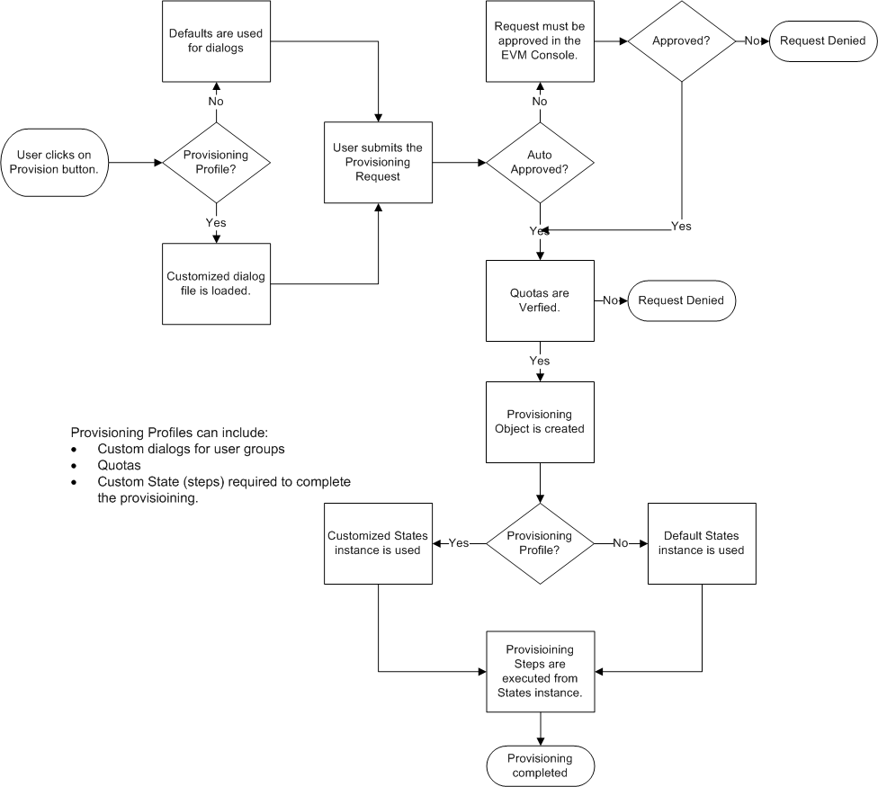

##### Creating a Provisioning Profile Instance

1.  Navigate to menu:Automate\[Explorer\].

2.  Using the tree located in the accordion, click menu:DOMAIN\[Cloud \>
    VM \> Provisioning \> Profile\].

    

    **DOMAIN** must be a user-defined Domain and not the locked ManageIQ
    Domain. If necessary, you can copy the class from the ManageIQ
    domain into a custom domain.

    This example uses the **Cloud** Namespace, but can also use the
    **Infrastructure** namespace.

    

3.  Click (**Configuration**),
    (**Add a New Instance**).

4.  Make the name of the tag identical to the name of the LDAP or
    {{ site.data.product.title }} group you are creating the instance for, replacing
    spaces in the group name with underscores. For example, change
    **{{ site.data.product.title }}-test group** to **{{ site.data.product.title }}-test\_group**.
    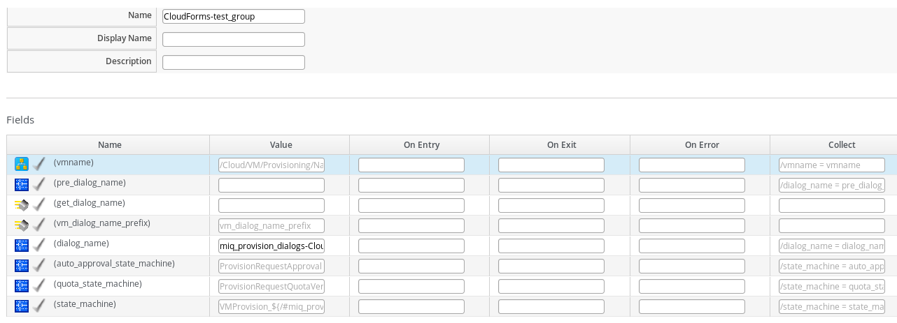

5.  In the dialog name field, enter the name of the customized dialog
    file. This file must reside on the {{ site.data.product.title }} appliance in the
    `/var/www/miq/vmdb/db/fixtures` directory. Red Hat recommends naming
    the file in the format `miq_provision_dialogs-groupname.rb` and
    copying this file to all {{ site.data.product.title }} appliances. For
    instructions on creating a custom dialog file, see [Customizing
    Provisioning Dialogs](#provisioning-dialogs-customizing).

    

    Be sure that the custom dialog file exists. If it does not, an error
    will appear when the user clicks on the **Provisioning** button in
    the {{ site.data.product.title }} console.

    

6.  Click **Add**.

##### Setting Provisioning Scope Tags

Some non-default placement methods, for example the
**redhat\_best\_placement\_with\_scope** or
**vmware\_best\_fit\_with\_scope** methods, may require you to set
**Provisioning Scope** tags for a host and a datastore.

To enable these resources for all groups, set the scope to **All**. To
limit access to a select group, create a tag in the **Provisioning
Scope** category with the exact name of the user group and set this tag
on the desired resources. See
[Tags](https://access.redhat.com/documentation/en-us/red_hat_cloudforms/4.7/html-single/general_configuration/#regions)
in *General Configuration* for information on creating tags.

To set the scope for a datastore:

1.  Navigate to menu:Compute\[Infrastructure \> Datastores\].

2.  Select the datastore to set the provisioning scope for.

3.  Click (**Policy**), and then
    (**Edit Tags**).

4.  From the **Select a customer tag to assign** drop down, select
    **Provisioning Scope** and then a value for the tag from the next
    drop down menu.

5.  Click **Save**.

#### Managing Key Pairs


