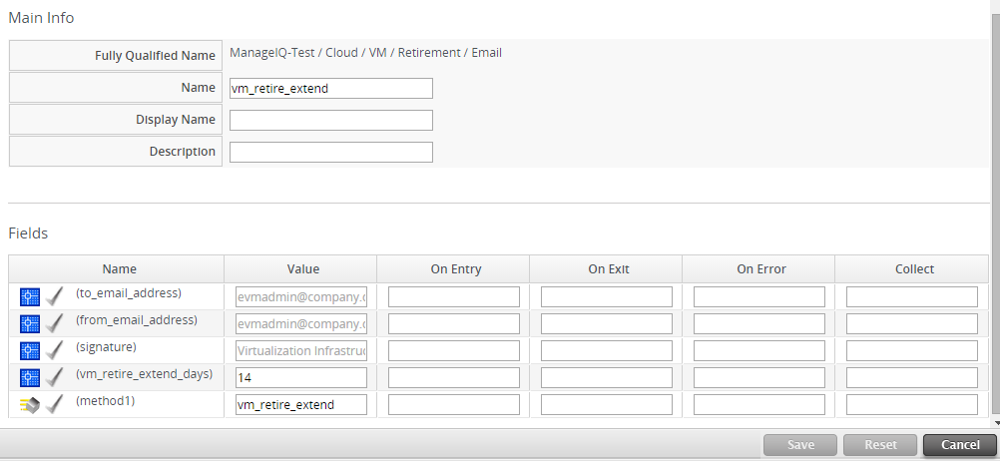

## Retirement

### Retiring Virtual Machines

#### Retiring Virtual Machines and Instances

When a virtual machine or instance is no longer required, it can be
retired. Once a virtual machine or instance reaches its retirement date,
it is immediately shut down and not allowed to restart. If an attempt to
restart is made, {{ site.data.product.title }} will shut down the virtual machine or
instance.

There are three built-in policies involved with retirement:

  - If the virtual machine or instance reaches its retirement date, it
    will be stopped even if it is running.

  - If a retired virtual machine or instance is requested to start
    through {{ site.data.product.title }}, the virtual machine or instance will not be
    allowed to start.

  - If a provider starts a retired virtual machine or instance outside
    of {{ site.data.product.title }}, the virtual machine or instance will be stopped.

{{ site.data.product.title }} provides a number of ways to retire a virtual machine or
instance:

  - By using the allocated buttons in the {{ site.data.product.title }} console.

  - When creating a provision request, a retirement date can be set up.

#### Using the Console to Retire a Virtual Machine

Through the {{ site.data.product.title }} console, you can retire a virtual machine on
a specific date or immediately.

#### Retiring a Virtual Machine Immediately

1.  Navigate to menu:Compute\[Infrastructure \> Virtual Machines\].

2.  Select the virtual machine or instance that you want to retire.

3.  Click (**Lifecycle**), then
    (**Retire this VM/Instance**).

The virtual machine or instance is immediately stopped, and will be shut
down if an attempt is made to restart it.

#### Setting a Retirement Date and Time for a Virtual Machine or Instance

You can schedule virtual machine retirement by specifying a date and
time, or by selecting a relative time a number of months, weeks, days or
hours ahead of the present time.

1.  Navigate to menu:Compute\[Infrastructure \> Virtual Machines\].

2.  Select the virtual machine or instance that you want to set a
    retirement date for.

3.  Click (**Lifecycle**), then
    (**Set Retirement Dates**).

4.  From **Enter Retirement Date as**, select **Specific Date and Time**
    or **Time Delay from Now** to schedule retirement.

    1.  To choose a **Specific Date and Time**, click the **Retirement
        Date and Time** field to open the calendar.

        1.  Select a retirement date using the calendar control.

        2.  Click  then select a retirement
            time (in UTC) using the arrows.

    2.  To retire the virtual machine using a relative time, select
        **Time Delay from Now**.

        1.  From **Time Delay**, specify a retirement time any number of
            months, weeks, days, or hours in the future using the
            arrows.

5.  Select a **Retirement Warning** if desired.

6.  Click **Save**.

The scheduled retirement date and time display in the virtual machine
summary screen.

#### Removing a Retirement Date for a Virtual Machine or Instance

1.  Navigate to menu:Compute\[Infrastructure \> Virtual Machines\].

2.  Select the virtual machine or instance that you want to remove the
    retirement date from.

3.  Click (**Lifecycle**), then click
    (**Set Retirement Date**).

4.  Click 
    to remove the retirement date.

### Setting Retirement in a Provision Request

If you are using {{ site.data.product.title }} to provision, you can set when you want
retirement in the provision request. To see how to create a request, see
[???](#provisioning-requests). A warning email will be sent to the owner
before the retirement.

#### Scheduling Retirement in a Provision Request

When provisioning a cloud instance or virtual machine, a multi-tabbed
screen appears where you can set up your provision requests.

1.  Click the **Schedule** tab to set when to provision your request and
    the lifespan of the virtual machine or instance.

2.  In **Lifespan**, you can choose to power on the virtual machines or
    instances after creation and set the **Time until Retirement**. If
    you select the time until retirement, you will select **Retirement
    Warning** accordingly.

3.  Click **Submit**.

    

### Extending Retirement Dates

{{ site.data.product.title }} **Automate** includes a method to extend the retirement
of a virtual machine or instance by 14 days. This section describes how
to create a button that invokes this method and how to edit the method
to change the number of days.

#### Creating a Custom Button to Extend Retirement

1.  Navigate to menu:Automate\[Customization\].

2.  Click the **Buttons** accordion.

3.  From the **Object Types** tree, select **VM and Instance**.

4.  Navigate to the button group to which you want to add this button.
    (If you do not have a button group, add one and then create the
    button.)

5.  Click (**Configuration**), then
    (**Add a new Button**).

6.  Type in a button text and button hover text, and select the image
    you want to use.

7.  In **Object Details**, select **Request** from the
    **/System/Process/** dropdown. By default, the message is `create`.
    Do not change it.

8.  In **Request**, type `vm_retire_extend`.

9.  Click **Add**.

#### Changing the Number of Days to Extend Retirement

1.  Navigate to menu:Automate\[Explorer\].

2.  Click menu:DOMAIN\[Cloud \> VM \> Retirement \> Email \>
    vm\_retire\_extend\].

    **Note:**

    DOMAIN must be a user-defined Domain and not the locked ManageIQ Domain. If necessary, you can copy the class from the ManageIQ domain into a custom domain.

    This example uses the **Cloud** Namespace, but you can also use the **Infrastructure** namespace.

3.  Click (**Configuration**), then
    (**Edit this Instance**).

4.  In the Value field, change the **vm\_retire\_extend\_days**
    attribute to the new value.

5.  Click **Save**. 
