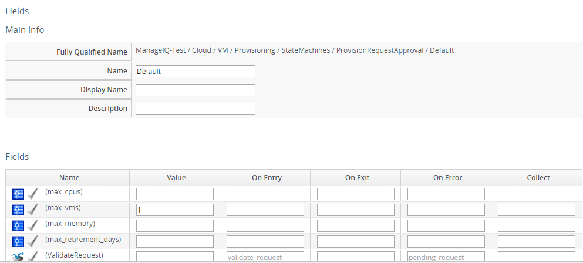
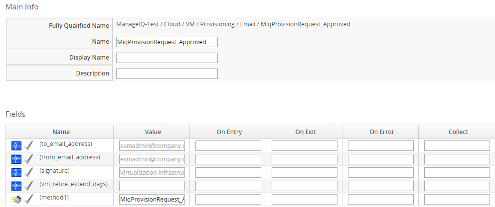

## Working with Requests

### Provisioning Request Approval Methods

In this chapter, you will learn about the different approval methods.
The request can be approved manually in the {{ site.data.product.title_short }} console, set
for automatic approval by setting options in the **Automate Explorer**,
or by using an external method.  When using an
external method, the approval actually takes place on the external
system and is sent directly for execution. This chapter discusses how to
view and edit requests in the {{ site.data.product.title_short }} Console, how to approve a
request, and how to set automatic approval parameters.

### Working with Provisioning Requests

After a provisioning request is sent, if you have proper authority, you
can copy, edit, delete, approve, or deny a request.

After submission, the appliance assigns each provision request a
**Request ID**. If an error occurs during the approval or provisioning
process, use this ID to locate the request in the appliance logs. The
**Request ID** consists of the region associated with the request
followed by the request number. As regions define a range of one
trillion database IDs, this number can be several digits long.

**Request ID Format**

**Request 99** in region 123 results in **Request ID
123000000000099**.

#### Reloading the Status of Provisioning Requests

1.  Navigate to **Services > Requests**.

2.  Click (**Refreshes the current display**).

#### Approving a Provisioning Request

After a user creates provisioning request, administrators have the
ability to approve the request and allow {{ site.data.product.title_short }} to complete
virtual machine or instance creation.

1.  Navigate to **Services > Requests**.

2.  Click on the request you want to approve.

3.  Click (**Approve this request**).

4.  Type in a **Reason** for the approval.

#### Denying a Provisioning Request

1.  Navigate to **Services > Requests**.

2.  Click on the request you want to deny.

3.  Click (**Deny this request**).

4.  Type in a **Reason** for the denial.

#### Copying a Provisioning Request

1.  Navigate to **Services > Requests**.

2.  Click on the request you want to copy.

3.  Click (**Copy original provision
    request**).

4.  Make changes to the request.

5.  Click **Submit**.

If the logged in user is not same as the requester or the request has been already approved or denied, you cannot edit or delete the request.

#### Editing a Provisioning Request

1.  Navigate to **Services > Requests**.

2.  Click on the request you want to edit.

3.  Click (**Edit the original provision
    request**).

4.  Make changes to the request.

5.  Click **Submit**.

#### Deleting a Provisioning Request

1.  Navigate to **Services > Requests**.

2.  Click on the request you want to delete.

3.  Click (**Delete this request**).

4.  Click **OK** to confirm.

#### Automatically Approving Requests

You can set thresholds for automatic approval of provisioning requests
and, therefore, remove the requirement to manually approve the request.
You can do this either as a global default or on a per template basis.

##### Enabling Global Defaults for Automatic Approval

To enable a global set of default approval values, edit the defaults
instance by navigating to **Automation > Embedded Automate > Explorer**, then
**DOMAIN > Cloud|Infrastructure > VM > Provisioning > StateMachines
\> ProvisionRequestApproval** in the accordion menu. The parameters in
this instance are used by the methods in that same class. By default,
the maximum number of virtual machines or instances that can be
automatically approved for provisioning is 1. To skip the check for the
maximum number of virtual machines, set this field to 0. Set this field
to -1 to force manual approval. At a minimum, you must change this
parameter for all others to be validated.

1.  Navigate to **Automation > Embedded Automate > Explorer**.

2.  From the tree in the accordion menu, select **DOMAIN > Cloud > VM
    > Provisioning > StateMachines > ProvisionRequestApproval
    Class**.

    **Note:**

    DOMAIN must be a user-defined Domain and not the locked ManageIQ Domain. If necessary, you can copy the class from the ManageIQ domain into a custom domain.

    This example uses the **Cloud** Namespace but can also use the **Infrastructure** namespace.

3.  Click (**Configuration**), then
    (**Edit this instance**).
    

    **Note:**

    Do not change any values other than those listed below. Doing so may prevent the automatic approval process from running.

      - Use **max\_cpus** to set the number of CPUs allowed to approve automatically the provisioning request.

      - Use **max\_vms** to set the maximum number of virtual machines or instances that are allowed to be provisioned automatically approve the request. If this is set to blank, no requests will be automatically approved.

      - Use **max\_memory** to set the maximum memory allowed to approve automatically the provisioning request.

      - Use **max\_retirement\_days** to set the maximum number of days until the virtual machine or instance is retired to automatically approve this request.

      - If a value is blank or **0**, the parameter is ignored.

4.  Click **Save**.

The thresholds for automatic approval are set. The next time a provision request is created these thresholds will be checked. If the requirements are met, the provisioning request will be approved with no user intervention.

##### Template Specific Approval Defaults

{{ site.data.product.title_short }} provides tags that can be used to set default automatic approval values on a per template or image basis. These values **supersede** those in the **Automate** model. Use these tags to eliminate the need for manual approval for all provisioning requests. To enable automatic approval, assign the tags directly to templates or images.

| Category Display Name (Name)                                   | Use (Sample values)                                                                                                                                            |
| -------------------------------------------------------------- | -------------------------------------------------------------------------------------------------------------------------------------------------------------- |
| Auto Approve Max CPU (prov\_max\_cpus)                         | Sets the maximum number of CPUs that can be automatically approved in a single provisioning request. Sample Values: 1, 2, 3, 4, 5                              |
| Auto Approve Max Memory (prov\_max\_memory)                    | Sets the maximum number of memory that can be automatically approved in a single provisioning request. Sample Values: 1, 2, 4, 8 (in GB)                       |
| Auto Approve Max Retirement Days (prov\_max\_retirement\_days) | Sets the maximum number of days until retirement that can be automatically approved in a single provisioning request. Sample Values: 30, 60, 90, 180 (in days) |
| Auto Approve Max VM (prov\_max\_vms)                           | Sets the maximum number of virtual machines or instances that can be automatically approved in a single provisioning request. Sample Values: 1, 2, 3, 4, 5     |

##### Assigning Tags to a Template for Auto Approval

1.  Navigate to **Compute > Infrastructure > Virtual Machines**.

2.  Click the **Templates** accordion, and select the templates that you
    want to tag.

3.  Click (**Policy**), and then
    (**Edit Tags**).

4.  Select a customer tag from the first dropdown, and then a value for
    the tag.

The thresholds for automatic approval for a specific template are set. The next time a provision request is created for this template these thresholds will be checked. If the requirements are met, the provisioning request will be approved with no user intervention.

##### Setting Provisioning Notification Email Addresses

{{ site.data.product.title_short }} contains a set of Automate instances for provisioning. These Automate instances also include email fields to set the sender and recipient of provisioning notifications, such as requests. These fields
are set to **evmadmin@company.com** as a default.

1.  Navigate to **Automation > Embedded Automate > Explorer**.

2.  Select an instance within the chosen class.

3.  Click (**Configuration**), then
    (**Edit this instance**).

4.  Type the desired email addresses in the **to\_email\_address** and
    **from\_email\_address** fields.

5.  Click **Save**.

    
